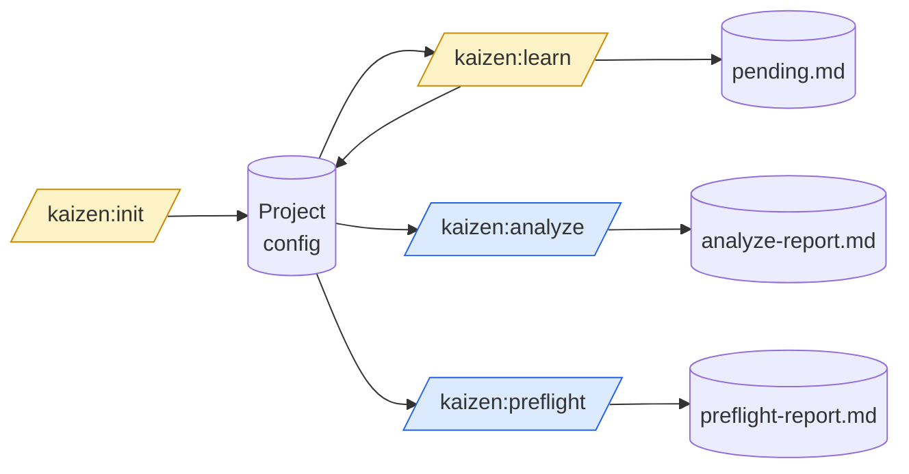
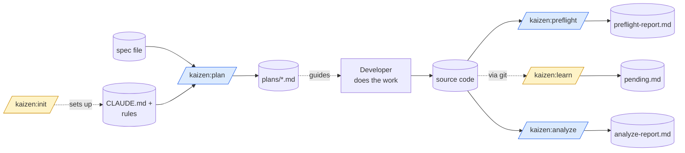

# Architecture — kaizen runtime

> How the plugin works once it's installed and a user invokes a command. This document is about runtime behavior, not about how to develop kaizen itself.

**This document covers eight skills + six plugin-level agents (v0.10.0 — the advanced workflow scaffold release):**
- `/kaizen:init` — bootstrap a project's Claude Code config (with profile system v0.10+). Sections 1-8.
- `/kaizen:learn` — propose updates to that config based on git activity. Section 9.
- `/kaizen:analyze` — read-only audit of code against the config. Section 11.
- `/kaizen:preflight` — pre-merge gate (deterministic checks + parallel LLM agents). Section 12.
- `/kaizen:plan` — auto-planner (spec doc → annotated task tree). Section 13.
- `/kaizen:docs` — documentation gap analyzer (v0.10+). Section 14.
- `/kaizen:bump` — semver bump suggester (v0.10+). Section 15.
- `/kaizen:finish` — end-of-task orchestrator (v0.10+). Section 16.

Plus the agents shipped by the plugin:
- `preflight-security`, `commit-suggester` — used by `/preflight` + `/finish`.
- `plan-context`, `plan-decomposer` — used by `/plan`.
- `docs-keeper` — used by `/docs` + `/finish`.
- `versioner` — used by `/bump` + `/finish`.

All eight skills share the same plugin tree and runtime model. They differ in what they read, what they write, and the directives that govern each. `/init` and `/learn` can mutate config; the rest are strictly read-only (only the artifact file is written, with `--auto-fix` as the single opt-in escape for `/preflight` and `/finish`).

## Mental model

There are always **two file trees** during a kaizen invocation:

```
┌───────────────────────────────┐        ┌───────────────────────────────┐
│  PLUGIN TREE (read-only)      │        │  USER PROJECT TREE (target)   │
│  ~/.claude/plugins/cache/     │ writes │  $CLAUDE_PROJECT_DIR          │
│  kaizen/...                   │ ────▶  │  (the user's repo / cwd)      │
│                               │        │                               │
│  • SKILL.md (instructions)    │ reads  │  • CLAUDE.md (generated)      │
│  • detect.sh                  │ ◀───── │  • .claude/ (generated)       │
│  • templates/...              │        │  • source code (pre-existing) │
└───────────────────────────────┘        └───────────────────────────────┘
```

The **plugin tree** is immutable at runtime. kaizen only reads from it. The **user project tree** is what kaizen writes into. Templates flow one direction only: plugin → user.

## Components

| Component | Type | Lifetime | Purpose |
|---|---|---|---|
| [`SKILL.md`](../plugins/kaizen/skills/init/SKILL.md) | LLM prompt | Loaded into context when `/kaizen:init` is invoked | Drives the decision tree. The "brain". |
| [`bin/kaizen-detect`](../plugins/kaizen/bin/kaizen-detect) | Bash script | Runs once per invocation (bash injection) | Deterministic project fingerprint. On `PATH` because it lives in `bin/`. |
| [`templates/_shared/`](../plugins/kaizen/skills/init/templates/_shared/) | Static files | Read on demand by SKILL.md | Files Claude writes regardless of stack. |
| [`templates/<preset>/`](../plugins/kaizen/skills/init/templates/) | Static files | Read on demand by SKILL.md | Stack-specific files (CLAUDE.md, settings.json, rules, hooks). |
| **The Claude agent** | LLM session | Active during invocation | Interprets SKILL.md, calls bash for detection, reads templates, writes to user project. |

### `SKILL.md` — the orchestrator

This is the only "active" component. Everything else is data or scripts that SKILL.md instructs Claude to consume.

**What it contains:**
- Frontmatter: `disable-model-invocation: true` (user-triggered only), `argument-hint`.
- A bash injection (`` !`detect.sh` ``) that runs at prompt-time so Claude sees the fingerprint as input.
- Seven-step protocol (read fingerprint → branch on existing config → branch on maturity → pick preset → generate files → optional archeology → report).
- Hard rules (never overwrite without `--force`, never write outside cwd, never commit, chmod hooks).

**What it does NOT do:**
- It does not execute any code itself. It only **instructs** Claude.
- It does not call APIs or write files directly. Claude does that via its tools (Bash, Read, Write, Edit).

### `kaizen-detect` — the deterministic eye

Runs **once** per `/kaizen:init` invocation via bash injection in `SKILL.md` (just `` !`kaizen-detect` ``). Output is JSON to stdout.

Lives in `plugins/kaizen/bin/` because Claude Code automatically adds plugin `bin/` directories to the Bash tool's `PATH` while the plugin is enabled. This is why the bash injection can omit variable substitution — important because Claude Code's permission check rejects `${...}` patterns in skill bash injections.

**Why a script and not pure LLM:**
- Free (no model tokens for file traversal).
- Predictable (a `find` on the same repo always gives the same answer).
- Fast (~50-200ms on small/medium repos).
- LLM does the *reasoning* over the JSON, not the data gathering.

**Output schema** (see [reference: detect schema](#detect-output-schema) below).

### `templates/` — the source of truth for what gets written

Three categories:

1. **`_shared/`** — files written to every project regardless of stack:
   - `.claude/agents/code-reviewer.md`
   - `.claude/hooks/session-start.sh`
   - `.claude/settings.local.json.example`
   - `.gitignore.append` (lines added to user's `.gitignore`)

2. **`<preset>/`** (currently `generic`, `typescript-node`, `python`) — stack-specific files:
   - `CLAUDE.md`
   - `.claude/settings.json`
   - `.claude/rules/<topic>.md` (path-scoped)
   - `.claude/hooks/<event>.sh`

3. **(future) overlays** — composable add-ons (e.g. `+react`, `+fastapi`, `+monorepo`). Not in v0.

**Template substitution variables** (resolved by Claude from `detect` JSON; v0.2+):

| Placeholder | Source | Example |
|---|---|---|
| `{{PROJECT_NAME}}` | `basename` of `cwd` | `my-app` |
| `{{STACK_RAW}}` | `detect.stack` CSV, exact | `typescript,frontend` |
| `{{STACK_FRIENDLY}}` | Claude-derived from `STACK_RAW` + `package.json` | `TypeScript / Vue 3 / Quasar` |
| `{{PACKAGE_MANAGER}}` | `detect.package_manager` | `pnpm` |
| `{{TEST_RUNNER}}` | inferred from `package.json` scripts/deps | `vitest`, `pytest`, `none` |
| `{{HAS_CI}}` | `detect.ci != "none"` | `true` / `false` |

**Enrichment markers** (v0.2+): templates may contain HTML-comment markers like `<!-- KAIZEN_ENRICH:<id> -->`. Claude replaces them with content from a directive registry defined in `SKILL.md`. This is the only way Claude is allowed to add content beyond placeholder substitution. Currently defined:

| Directive id | Where it lives | What Claude does |
|---|---|---|
| `framework_stack` | inside `## Stack` of `CLAUDE.md` | Reads `package.json`, appends `- <Role>: <Lib> v<ver>` bullets for detected frameworks (max 8) |
| `architecture_layout` | inside `## Architecture (brief)` | Globs `src/*/`, appends `` - `src/<dir>/` — <purpose> `` bullets using a known-names lookup |

Outside markers, templates are **rigid** — verbatim after placeholder substitution. Conditional removals (e.g., remove `Test:` line when no test runner) are allowed only per an explicit table in SKILL.md, and each one is logged in the drift report.

## Data flow

```
       (1) /kaizen:init [--args]
              │
              ▼
       ┌────────────────────┐
       │  Claude loads      │
       │  SKILL.md into     │
       │  context           │
       └─────────┬──────────┘
                 │
                 ▼
       ┌────────────────────┐
   (2) │  Bash injection    │   The !`detect.sh` line in SKILL.md
       │  runs detect.sh    │   executes BEFORE Claude sees the prompt.
       └─────────┬──────────┘   Its stdout is interpolated in.
                 │
                 ▼  JSON fingerprint
       ┌────────────────────┐
   (3) │  Claude reasons    │   Reads JSON, picks preset,
       │  over fingerprint  │   decides branch (empty/scaffold/...)
       └─────────┬──────────┘
                 │
                 ▼  (may ask user via interactive prompt)
       ┌────────────────────┐
   (4) │  Claude reads      │   Uses Read tool on
       │  template files    │   templates/_shared/* + templates/<preset>/*
       └─────────┬──────────┘
                 │
                 ▼  in-memory substitution of {{PLACEHOLDERS}}
       ┌────────────────────┐
   (5) │  Claude writes     │   Uses Write tool, target paths under
       │  to user project   │   $CLAUDE_PROJECT_DIR
       └─────────┬──────────┘
                 │
                 ▼
       ┌────────────────────┐
   (6) │  Claude chmod +x   │   For files written to .claude/hooks/
       │  shell scripts     │
       └─────────┬──────────┘
                 │
                 ▼
       ┌────────────────────┐
   (7) │  Claude prints     │   Fixed format: ✓ detected, files created,
       │  summary report    │   files skipped, suggested next steps
       └────────────────────┘
```

## Boundaries

**kaizen writes** (under `$CLAUDE_PROJECT_DIR`):

```
CLAUDE.md
.claude/settings.json
.claude/settings.local.json.example
.claude/rules/*.md
.claude/agents/*.md
.claude/hooks/*.sh         (always chmod +x)
.gitignore                 (appends only, never replaces)
```

**kaizen never touches:**

- Anything outside `$CLAUDE_PROJECT_DIR`.
- Source code in the user's project.
- `package.json`, `pyproject.toml`, or any dependency manifest.
- `.git/` (no commits, no branch ops).
- Existing files at the paths above (without `--force`).

**kaizen may read:**

- Anything under `$CLAUDE_PROJECT_DIR` (via `detect.sh` and Read tool) to inform decisions.
- Template files in the plugin tree.

## Detect output schema

`detect.sh` always emits a JSON object with this exact shape:

```json
{
  "project_name": "my-app",
  "stack": "typescript,frontend",
  "package_manager": "pnpm",
  "maturity": "small",
  "workspaces": {
    "type": "pnpm",
    "packages": ["backend", "frontend"],
    "count": 2
  },
  "git": {
    "is_repo": true,
    "commits": 47,
    "branch": "main"
  },
  "existing_claude_config": "CLAUDE.md,settings.json",
  "tests_found": 12,
  "ci": "github-actions",
  "cwd": "/Users/alex/projects/my-app"
}
```

| Field | Type | Possible values |
|---|---|---|
| `project_name` | string | The manifest's own `name`; falls back to `basename(cwd)`. Never the directory name when a manifest exists — see [ADR-0007](./decisions/0007-monorepo-is-a-shape.md) |
| `workspaces.type` | string | `pnpm` \| `npm` \| `lerna` \| `turbo` \| `nx` \| `cargo` \| `go` \| `none` |
| `workspaces.packages` | string[] | Workspace globs expanded to directories holding a manifest, sorted |
| `workspaces.count` | int | Length of `packages` |
| `stack` | string (CSV) — scanned from the root manifest **and every workspace member** | `generic` \| `typescript` \| `javascript` \| `python` \| `go` \| `rust` \| `java` \| `ruby` \| `php` \| `elixir` (optionally `+frontend`, `+backend-node`) |
| `package_manager` | string | `pnpm` \| `yarn` \| `bun` \| `npm` \| `uv` \| `poetry` \| `pipenv` \| `pip` \| `none` |
| `maturity` | string | `empty` (0 src files) \| `scaffold` (1-5) \| `small` (6-50) \| `mature` (50+) |
| `git.is_repo` | bool | true / false |
| `git.commits` | int | 0+ |
| `git.branch` | string | branch name or `"none"` |
| `existing_claude_config` | string (CSV) | empty string if nothing, else CSV of: `CLAUDE.md`, `settings.json`, `skills/`, `agents/`, `hooks/`, `rules/`, `.mcp.json` |
| `tests_found` | int | count of `*.test.*`, `*.spec.*`, `test_*.py`, `*_test.go` |
| `ci` | string | `github-actions` \| `gitlab` \| `circleci` \| `jenkins` \| `none` |
| `cwd` | string | absolute path to user's project root |

## Preset selection logic

The `stack` field maps to a template directory:

| `stack` contains | preset used |
|---|---|
| `typescript` or `javascript` | `typescript-node` |
| `python` | `python` |
| anything else (or `generic`) | `generic` |

Overridden by `--preset <name>` argument. Future versions add `go`, `rust`, `java`, etc.

## Environment variables available at runtime

| Variable | Set by | Used by |
|---|---|---|
| `CLAUDE_PROJECT_DIR` | Claude Code | `detect.sh`, `session-start.sh`, all hook scripts |
| `CLAUDE_SKILL_DIR` | Claude Code (during skill execution) | Bash injections in `SKILL.md` to locate `scripts/` and `templates/` |

## Failure modes and recovery

| Failure | Detection | Behavior |
|---|---|---|
| `detect.sh` errors or non-JSON output | SKILL.md instructs Claude to surface raw output | Abort. No files written. |
| Existing `.claude/` config and no `--force` | `existing_claude_config != ""` | Abort + interactive prompt: abort / force / merge-only. |
| Uncommitted changes touching `.claude/` | (planned for v0.2) | Refuse to write until committed or stashed. |
| Template file missing in plugin | Read tool error | Claude reports the missing template path; aborts. |
| User cwd outside a writable directory | Write tool error | Surfaces filesystem error; aborts. |

## Why this architecture

Four deliberate choices worth knowing:

1. **Deterministic facts, LLM reasoning.** `kaizen-detect` is pure bash because file traversal in a model wastes tokens and can hallucinate. Reasoning over a small JSON is what models are good at.
2. **Templates as data, not code.** Adding a new stack means dropping files in `templates/<new-stack>/`. No SKILL.md changes needed for additions — only when behavior changes.
3. **Hybrid templates (v0.2+): rigid bones + flexible flesh.** Sections like `Commands` and `Never do` are verbatim after placeholder substitution. Sections like `Stack` and `Architecture` have `KAIZEN_ENRICH` markers where Claude fills in detected data. This balances determinism with adaptation: the user knows exactly which sections were customized and which came from the template.
4. **Mandatory drift report.** Every `/kaizen:init` run ends with a per-file list of substitutions, enrichments, and conditional removals applied. No silent customization — if Claude adapted something, it says so.
5. **One LLM session, one invocation.** No subagents spawned for `/kaizen:init` (except optional archeology on mature repos). The skill runs in the user's main context so the user can observe and intervene.

---

# 9. `/kaizen:learn` runtime (v0.3.0+)

> Different goal from `/init`: instead of bootstrapping config, `/learn` **proposes incremental updates** to existing config based on what the project has actually been doing.

## Mental model — three things that exist

```
┌─────────────────────────────┐       ┌─────────────────────────────┐       ┌─────────────────────────────┐
│  PLUGIN TREE (read-only)    │       │  USER PROJECT (mostly read) │       │  PENDING PROPOSALS          │
│  ~/.claude/plugins/cache/   │ reads │  $CLAUDE_PROJECT_DIR        │ reads │  .claude/kaizen/pending.md  │
│                             │ ────▶ │                             │ ────▶ │  (auto-gitignored)          │
│  • SKILL.md (instructions)  │       │  • CLAUDE.md (read)         │       │                             │
│                             │       │  • .claude/rules/* (read)   │       │  Written by analyze mode    │
│                             │       │  • .git/ → log/diff (read)  │       │  Read by show/apply         │
│                             │       │                             │       │  Deleted by apply/discard   │
└─────────────────────────────┘       └─────────────────────────────┘       └─────────────────────────────┘
                                                  │                                       │
                                                  │ writes only in apply mode             │
                                                  ▼                                       │
                                       ┌─────────────────────────────┐                    │
                                       │  Edits to CLAUDE.md /       │ ◀──────────────────┘
                                       │  .claude/rules/*            │
                                       │  + delete pending.md        │
                                       └─────────────────────────────┘
```

## Components

| Component | Type | Lifetime | Purpose |
|---|---|---|---|
| [`skills/learn/SKILL.md`](../plugins/kaizen/skills/learn/SKILL.md) | LLM prompt | Loaded into context when `/kaizen:learn` is invoked | State machine + subcommand dispatch + analyze/apply logic |
| `pending.md` | Markdown file | Created by analyze, consumed by apply/discard | Persistent draft of proposed config changes |

There are **no helper scripts** like `kaizen-detect`. All logic is in the SKILL.md prompt + standard tools (`Read`, `Edit`, `Write`, `Bash(git *)`).

## State machine

```
                       ┌──────────────────────────────┐
                       │  .claude/kaizen/pending.md   │
                       │  exists?                     │
                       └──────────────────────────────┘
                                │
                  ┌─────────────┴─────────────┐
                  │ NO                        │ YES
                  ▼                           ▼
       ┌──────────────────┐         ┌──────────────────────┐
       │  STATE A         │         │  STATE B             │
       │  no pending      │         │  pending exists      │
       └──────────────────┘         └──────────────────────┘
                  │                           │
   /learn (no args)│                          │ /learn (no args)
                  ▼                           ▼
       ┌──────────────────┐         ┌──────────────────────┐
       │  analyze →       │         │  REFUSE              │
       │  write pending   │         │  "use show/apply/    │
       │  → State B       │         │   discard first"     │
       └──────────────────┘         └──────────────────────┘
                                              │
                              ┌───────────────┼───────────────┐
                              │               │               │
                       /learn show     /learn apply    /learn discard
                              │               │               │
                              ▼               ▼               ▼
                       (print file)    (apply edits     (delete
                                        + delete         pending)
                                        pending)         → State A
                                        → State A
```

This prevents proposal accumulation. The user must explicitly resolve a pending batch before generating new proposals.

## `pending.md` schema

Always at `.claude/kaizen/pending.md`. Created with this exact structure:

```markdown
# kaizen :: pending proposals

Generated: <ISO 8601 timestamp>
Plugin version: <plugin version>
Signal sources used: git (range: <ref>..HEAD, <N> commits)

> Review each proposal below. Run `/kaizen:learn apply` to accept all,
> `/kaizen:learn discard` to throw away, or edit this file by hand.

---

## Proposal 1

**Target file**: <path>
**Target section**: <section heading | (new file)>
**Action**: <append | insert after <line> | move <from> to <to> | create new file>

**Content**:
```
<exact text to add, in its target format>
```

**Evidence**:
- <commit SHA>: <commit message> — <what it touched>
- Files affected: <paths>
- Why this matters: <one-sentence rationale>

---

## Proposal 2
...
```

The user **can edit `pending.md` by hand** before applying. Common edits: change the wording in the `Content` block, remove a proposal entirely (delete its `## Proposal N` block), change the target section.

## Boundaries

**`/kaizen:learn` reads**:
- `CLAUDE.md` (always)
- `.claude/rules/*` (always)
- `git log` / `git diff` / `git show` (always)
- `.claude/kaizen/pending.md` (when in show/apply/discard mode)

**`/kaizen:learn` writes**:
- `.claude/kaizen/pending.md` (in analyze mode)
- `.gitignore` (only if `.claude/kaizen/` not already gitignored; one-time append)
- `CLAUDE.md`, `.claude/rules/*` (**only in apply mode**, validated first)

**`/kaizen:learn` never touches**:
- Source code.
- `package.json`, `pyproject.toml`, or any dependency manifest.
- `.git/` (no commits, no branches; only reads).
- Anything outside `$CLAUDE_PROJECT_DIR`.

## Signal sources — current and roadmap

```
                  v0.7 (today)                    v0.8 (planned)               v0.9+ (planned)
                  ─────────────                   ──────────────               ──────────────
              ┌──────────────────┐           ┌──────────────────┐         ┌──────────────────┐
              │  git log/diff    │           │  git log/diff    │         │  git log/diff    │
              │  + range control │           │  + session conv. │         │  + session conv. │
              │  (--since/--limit)│          │   (opt-in)       │         │  + auto-memory   │
              │                  │           │                  │         │   (opt-in)       │
              └────────┬─────────┘           └────────┬─────────┘         └────────┬─────────┘
                       │                              │                            │
                       ▼                              ▼                            ▼
                  conservative,             richer (captures             richest (cross-session
                  deterministic;            user corrections             learning), needs
                  range explicit            not in commits)              anti-circularity
                                                                         safeguards
```

**v0.7 added**: explicit range control via `--limit=<N>` (in addition to existing `--since=<ref>`), plus prominent range labeling in both the console summary and `pending.md` header. Addresses a real UX gap observed during validation: "I don't know what was analyzed".

**Why this order**: each step up adds richer signal but also more failure modes. Git is stable and intentional. Session conversation captures real-time guidance but is volatile. Auto-memory is what Claude told itself — most "advanced" but risks self-reinforcement without dedup against current CLAUDE.md content.

Future signal sources will be **opt-in flags** (`--include-session`, `--include-memory`), never default.

## Failure modes

| Failure | Detection | Behavior |
|---|---|---|
| Not a git repo | `git rev-parse --is-inside-work-tree` fails | Refuse. Suggest `git init` + at least one commit. |
| Fewer commits than requested | `git log` returns less | Analyze what exists. Note in report. |
| No CLAUDE.md | File not found | Refuse. Suggest `/kaizen:init` first. |
| `pending.md` malformed during apply | Parse fails | Stop. Print line number. Don't apply any. |
| Target section in apply doesn't exist | `Edit` tool fails | Stop at that proposal. Don't apply remaining. Tell user to edit `pending.md`. |
| `pending.md` already exists (analyze mode) | File exists | Refuse. Tell user to show/apply/discard. |

## Why this architecture

Five deliberate choices specific to `/learn`:

1. **Always file-mediated, never silent.** Proposals live in `pending.md` because a markdown file is auditable, editable, and survives session restarts. In-memory "remembered" proposals would be opaque and fragile.
2. **State machine prevents accumulation.** Refusing to generate new proposals while pending exist is annoying but correct — accumulating drafts is how config files become bloated incoherent messes.
3. **Apply is transactional-ish, not auto-apply.** Even if a user types `/kaizen:learn apply` immediately after the analyze, apply re-reads `pending.md` and validates each target. There's no in-session "memory" of what was just analyzed.
4. **Git only in v0.3 for predictability.** Other signal sources (session, auto-memory) are documented in the SKILL.md roadmap but explicitly out of scope. Each future addition is a separate opt-in flag, never default.
5. **No subagents.** `/learn` runs entirely in the user's main session so they can interrupt mid-analysis. Cheap, transparent, easy to debug.

---

# 11. `/kaizen:analyze` runtime (v0.4.0+)

> Read-only diagnostic. Mirror skill to `/learn`: where `/learn` watches git and proposes config changes, `/analyze` watches **current code** and reports issues against the existing config.

## Mental model — strict read-only

```
┌─────────────────────────────┐       ┌─────────────────────────────┐
│  PLUGIN TREE (read-only)    │       │  USER PROJECT (read-only)   │
│  ~/.claude/plugins/cache/   │ reads │  $CLAUDE_PROJECT_DIR        │
│                             │ ────▶ │                             │
│  • SKILL.md (instructions)  │       │  • CLAUDE.md                │
│                             │       │  • .claude/rules/*          │
│                             │       │  • source files (src/...)   │
│                             │       │  • package.json (optional)  │
└─────────────────────────────┘       └─────────────────────────────┘
                                                  │
                                                  │ writes ONLY to one file
                                                  ▼
                                       ┌─────────────────────────────┐
                                       │  REPORT (overwritten)       │
                                       │  .claude/kaizen/            │
                                       │    analyze-report.md        │
                                       │  (auto-gitignored)          │
                                       └─────────────────────────────┘
```

Unlike `/init` (writes config) and `/learn` (writes pending, optionally applies), `/analyze` writes **exactly one file**: the report. No source code is touched. No CLAUDE.md is touched. No state machine — every run is independent.

## Components

| Component | Type | Lifetime | Purpose |
|---|---|---|---|
| [`skills/analyze/SKILL.md`](../plugins/kaizen/skills/analyze/SKILL.md) | LLM prompt | Loaded into context when `/kaizen:analyze` is invoked | Mode dispatch + pattern library + per-mode algorithms + report writer |
| `analyze-report.md` | Markdown file | Overwritten on every run | Persistent output for re-reading via `show` or for sharing |

No helper scripts. All logic is in SKILL.md + standard tools (`Read`, `Write`, `Glob`, `Grep`, `Bash(test|ls|cat|wc|mkdir)`).

## Modes (combinable)

| Flag | Reads | Reports |
|---|---|---|
| `--best-practices` | `CLAUDE.md`, `.claude/rules/*`, all source files | Violations of stated conventions, by file:line. Plus "Unchecked" list for conventions outside the pattern library. |
| `--coverage` | `.claude/rules/*` (parses `paths:` frontmatter), all source files | Directories with <20% rule coverage. Stale rules (paths match no files). Always-loaded rules. |
| `--architecture` | `CLAUDE.md` (`## Architecture` section), `src/*/`, optionally `package.json` | Documented-but-missing dirs, exists-but-undocumented dirs. Stack section drift vs package.json. |
| *(none)* | All of the above | All three sections in one report |
| `show` | `analyze-report.md` | Re-prints last report. No analysis performed. |

## Built-in pattern library (`--best-practices` v0.4)

Conventions verified automatically when matched by keyword in CLAUDE.md / rules:

```
named exports only      → grep ^export default
no console.log          → grep console\.log (excluding tests)
no any                  → grep ': any\b' and 'as any\b' (TS)
no eslint-disable       → grep eslint-disable lacking inline justification
no print() for logging  → grep ^print( (Python, excl. tests/scripts/__main__)
no bare except          → grep except\s*:\s*$ (Python)
no wildcard imports     → grep 'from .* import \*' (Python)
no mutable defaults     → grep 'def f([^)]*=\[\]' / '=\{\}' (Python)
tests next to source    → for each .ts file, check sibling *.test.* exists
```

Conventions NOT matching any keyword are listed explicitly under **"Unchecked (manual review)"**. This is a feature, not a limitation: users see exactly what kaizen verifies vs. what they need to inspect themselves.

## Report schema

Always at `.claude/kaizen/analyze-report.md`. Overwritten on every run.

```markdown
# kaizen :: analyze report

Generated: <ISO 8601>
Plugin version: <v>
Modes run: <list>

---

## Best practices
[Section per --best-practices; omitted if mode not run]

## Documentation coverage
[Section per --coverage; omitted if mode not run]

## Architecture drift
[Section per --architecture; omitted if mode not run]

---

## Suggestions
[Specific, evidence-based, actionable. Omitted if nothing to suggest.]
```

Console summary printed alongside the file write — concise, with counts per mode.

## Boundaries

**`/analyze` reads**:
- `CLAUDE.md` (always)
- `.claude/rules/*` (always)
- Source files via Glob (project-defined extensions)
- `package.json` (optional, for `--architecture` stack drift)
- `.claude/kaizen/analyze-report.md` (only in `show` mode)

**`/analyze` writes**:
- `.claude/kaizen/analyze-report.md` (overwritten on every run)
- `.gitignore` (only if `.claude/kaizen/` not yet ignored — one-time append, same logic as `/learn`)

**`/analyze` never touches**:
- Source code.
- `CLAUDE.md`, `.claude/rules/*`, `.claude/settings.json`, any other config.
- `package.json` or dependency manifests.
- Anything outside `$CLAUDE_PROJECT_DIR`.
- `pending.md` from `/learn` (independence).

## Relationship to `/learn`

Deliberately **decoupled** in v0.4:

| Aspect | `/learn` | `/analyze` |
|---|---|---|
| Input | Git history (commits, diffs) | Current files (source + config) |
| Output | `.claude/kaizen/pending.md` (proposals) | `.claude/kaizen/analyze-report.md` (findings) |
| Can mutate? | Yes, via `/learn apply` | No, ever |
| State machine | Yes (no-pending ↔ has-pending) | None |
| Shared `.claude/kaizen/` dir | Yes | Yes |

The user can read the analyze report and then run `/learn` to formalize fixes — but kaizen never automates that bridge. Decoupling is the v0.4 contract; future versions may add an opt-in `--feed-to-learn` flag if usage patterns justify it.

## Failure modes

| Failure | Behavior |
|---|---|
| `CLAUDE.md` missing | Refuse all modes. Suggest `/kaizen:init` first. |
| `.claude/rules/` missing | `--coverage` notes "no rules to check against". Other modes proceed. |
| No source files match | `--coverage` / `--architecture` report "No source files detected". `--best-practices` proceeds with empty result set. |
| Not a git repo | All modes work without git. No refusal. |
| Pattern library has no match | `--best-practices` reports ALL conventions as Unchecked. Still produces report. |
| `package.json` missing | `--architecture` skips Stack drift sub-check, notes in report. |
| Grep returns >50 matches | Lists first 20 with "+N more". Bounded. |

## Why this design

Five deliberate choices specific to `/analyze`:

1. **Read-only is the contract, not a side-effect.** Diagnostic and surgery are different jobs. Coupling them is how tools become bossy and lose user trust.
2. **Pattern library over LLM-everything.** Checking "no console.log" should be a `Grep` call, not "Claude reads every file and judges". Patterns are auditable, fast, and reproducible.
3. **Unchecked conventions are explicit.** Silently skipping unverifiable rules would hide kaizen's limitations. Listing them tells the user: "these need eyes."
4. **Single output file, overwritten.** No archive of past reports. Reports are diagnostic snapshots; you take a new one when you want a new snapshot. Archiving adds complexity for little gain.
5. **No state machine.** Unlike `/learn`, there's nothing to gate — every run is read-only and idempotent. The simplicity is deliberate.

---

# 12. `/kaizen:preflight` runtime (v0.5.0+)

> Pre-merge gate combining deterministic checks (Bash) with LLM reasoning (parallel agents). The first kaizen skill to use the **multi-agent dispatch** pattern — a deliberate architectural step toward the plugin's longer roadmap of operational skills.

## Mental model — orchestrator + specialized agents

```
┌─────────────────────────────┐
│  PLUGIN TREE (read-only)    │
│  ~/.claude/plugins/cache/   │
│                             │
│  • preflight/SKILL.md       │ (orchestrator)
│  • agents/preflight-security│
│  • agents/commit-suggester  │
└──────────────┬──────────────┘
               │
               │ orchestrator skill spawns
               │
   ┌───────────┴──────────────────────┐
   │                                  │
   ▼  Phase 1                         ▼  Phase 2
┌───────────────────┐         ┌───────────────────────────┐
│  Deterministic    │         │  LLM agents (parallel)    │
│  via Bash tool    │         │  via Task tool            │
│  (sequential)     │         │  (single message, 2 calls)│
│                   │         │                           │
│  • tests          │         │  • preflight-security     │
│  • typecheck      │         │  • commit-suggester       │
│  • lint           │         │                           │
└───────────────────┘         └───────────────────────────┘
               │                                  │
               └────────────┬─────────────────────┘
                            │
                            ▼  Phase 3
                  ┌─────────────────────┐
                  │  Aggregate          │
                  │  + compute verdict  │
                  │  + write report     │
                  └─────────────────────┘
```

This is the first kaizen skill where the orchestrator/agent split is meaningful. `/init` and `/learn` and `/analyze` are single-agent skills; `/preflight` coordinates three execution surfaces (Bash tool, two Task invocations) into a unified verdict.

## Components

| Component | Type | Lifetime | Purpose |
|---|---|---|---|
| [`skills/preflight/SKILL.md`](../plugins/kaizen/skills/preflight/SKILL.md) | LLM prompt (orchestrator) | Loaded when `/kaizen:preflight` is invoked | Phase dispatch, verdict computation, report assembly |
| [`agents/preflight-security.md`](../plugins/kaizen/agents/preflight-security.md) | Subagent definition | Spawned in Phase 2 | Security audit of changed files |
| [`agents/commit-suggester.md`](../plugins/kaizen/agents/commit-suggester.md) | Subagent definition | Spawned in Phase 2 | Conventional Commits author |
| `preflight-report.md` | Markdown file | Overwritten on every run | Persistent output |

## Three-phase execution

### Phase 1: deterministic checks (sequential, Bash)

The orchestrator runs three commands sequentially via the Bash tool:

1. Tests — `<pm> test` / `pytest` / `go test ./...` / `cargo test` (auto-detected from package.json or stack files)
2. Typecheck — `npx tsc --noEmit` / `mypy .` / `go vet ./...` / `cargo check`
3. Lint — `npx eslint .` / `ruff check .`

For each: capture exit code, capture output (bounded to last 50 lines), classify as `pass` / `fail` / `skip`. No fail-fast — all three run regardless of individual results.

**Why sequential and not parallel?** Three reasons: (a) bash background processes in a single skill invocation are tricky to manage; (b) the commands are fast enough that sequential overhead is negligible compared to LLM agent dispatch; (c) sequential output ordering is more predictable for the report. Parallel deterministic execution is a v0.7 optimization candidate.

### Phase 2: LLM agents (parallel, Task)

The orchestrator issues **two `Task` tool calls in a single message**, which Claude Code schedules in parallel:

- `Task(subagent_type='preflight-security', prompt=...)` — receives the list of changed source files
- `Task(subagent_type='commit-suggester', prompt=...)` — receives the diff range (`<base>..HEAD`)

Each agent runs in its own fresh context (no main session bloat). Each returns a structured text result that the orchestrator captures.

**Why parallel?** Token-cost-wise, parallel ≈ sequential (the agents do the same work either way). But wall-clock-wise, parallel is ~2× faster — the user gets the verdict in the time of the slower agent, not the sum.

### Phase 3: verdict + report

Verdict computation (deterministic logic in the orchestrator):

```
if tests==fail OR typecheck==fail OR security has critical
    → BLOCK
else if lint has errors OR security has high
    → HOLD
else
    → SHIP
```

Skipped checks (no tooling installed) **never** trigger verdict changes. Report assembled, written to `.claude/kaizen/preflight-report.md`, console summary printed.

## Agent contracts

### `preflight-security`

| Aspect | Value |
|---|---|
| Tools | `Read`, `Grep`, `Glob`, `Bash(git diff *)`, `Bash(git show *)`, `Bash(cat *)` |
| Model | `claude-sonnet-4-6` |
| Scope | ONLY the files listed in the prompt — does not crawl |
| Output | Per-finding `[<severity>] <file>:<line>` blocks, OR exactly `"No security findings."` |
| Severity tiers | `critical` (blocks), `high` (holds), `medium`, `low` |
| Hard rules | Read-only (no Edit/Write tool); never pads with non-security advice; never speculates |

### `commit-suggester`

| Aspect | Value |
|---|---|
| Tools | `Read`, `Bash(git diff *)`, `Bash(git log *)`, `Bash(git status)`, `Bash(git show *)` |
| Model | `claude-sonnet-4-6` |
| Scope | The diff range passed in the prompt |
| Output | Primary message + 2 alternatives + optional body, in fixed format |
| Style | Conventional Commits ONLY in v0.5 (auto-detection from history in v0.6+) |
| Hard rules | Imperative tense; ≤72 char subject; no emojis; never commits; never invents context |

## Report schema

Always at `.claude/kaizen/preflight-report.md`. Overwritten on every run.

```markdown
# kaizen :: preflight report

Generated: <ISO 8601>
Plugin version: <v>
Base ref: <ref>
Changed files: <count> source files (+ <N> non-source)

---

## Verdict: <SHIP | HOLD | BLOCK>

<one-line reason>

| Counts |
|---|---|
| critical / high / medium / low | ... |
| lint errors / warnings | ... |
| test failures, typecheck errors | ... |

---

## Phase 1 — Deterministic checks
### Tests / Typecheck / Lint
Status + command + output excerpt

---

## Phase 2 — LLM review
### Security (preflight-security agent)
<verbatim agent output>

### Suggested commit message (commit-suggester agent)
<verbatim agent output>

---

## Suggestions
(stack/project-specific; omitted if none)
```

## Boundaries

**`/preflight` reads**:
- Git state: branch, base ref existence, diff, log
- `package.json` / `pyproject.toml` / `go.mod` / `Cargo.toml` (for command detection)
- Source files (via Bash for test commands; via Glob if needed; otherwise indirectly through the agents)

**`/preflight` writes**:
- `.claude/kaizen/preflight-report.md` (overwritten each run)
- `.gitignore` (only if `.claude/kaizen/` not yet ignored — one-time append, same logic as `/learn`/`/analyze`)

**`/preflight` never touches**:
- Source code (no Edit tool).
- `CLAUDE.md`, rules, settings, agents (the user's, not the plugin's).
- `.git/` (no commits, no branches; reads only).
- Anything outside `$CLAUDE_PROJECT_DIR`.
- Other `.claude/kaizen/*.md` files (`pending.md` from /learn, `analyze-report.md` from /analyze).

## Relationship to other skills



`/preflight` reads config (CLAUDE.md / rules) the same way `/analyze` does, but its purpose is **gating**, not auditing. The two are independent in v0.5 — `/preflight` doesn't call `/analyze` internally. v0.6 may add composition (e.g., `/preflight` invokes `/analyze --best-practices` scoped to diff).

## Failure modes

| Failure | Behavior |
|---|---|
| Not a git repo | Refuse. Suggest `git init` + at least one commit. |
| No changes vs base | Stop with friendly message; no report written. |
| `CLAUDE.md` missing | Don't refuse — preflight works without kaizen-bootstrapped config. Add a suggestion. |
| All three deterministic check commands skip | Run agents anyway; warn in report. |
| Agent fails or garbles output | Log in the report; verdict computed from successful parts; don't fail the whole preflight. |
| Huge diff (>1000 files) | Run anyway with warning; agents work on source-filtered subset. |

## Why this design

Six deliberate choices specific to `/preflight`:

1. **Multi-agent orchestration.** First kaizen skill where a single user invocation dispatches multiple subagents. Sets the pattern future skills (`/plan` likely v0.6+, others) will follow. Lower-friction to prove the pattern here with 2 agents than with 5 in `/plan`.
2. **Hybrid execution.** Bash for what's deterministic (cheap, predictable, parseable exit codes); agents for what needs reasoning (security context, message tone). Single-paradigm solutions waste either tokens or developer time.
3. **Parallel agent dispatch is real.** Two `Task` calls in one message ≈ 2× wall-clock speedup vs. sequential. Cost is the same. Always parallelize independent agent work.
4. **Three-tier verdict.** SHIP/HOLD/BLOCK gives more signal than green/red. Distinguishes "fix before merging" from "don't merge at all" — actionable difference.
5. **Plugin agents over project agents (for this skill).** `preflight-security` lives in the plugin so every kaizen user gets consistent security review. The user's `code-reviewer.md` (from `/init`) stays for manual general-purpose review — two agents, two jobs.
6. **Read-only contract, with opt-in mutation (v0.8+).** Same as `/analyze` by default. v0.8 added `--auto-fix` as the single opt-in escape from read-only — and it's bounded to what the configured formatters/linters do (kaizen never edits files manually). Risk-aware sizing and commit style auto-detection remain deferred to v0.9 because each carries calibration risk that needs more design.

---

# 13. `/kaizen:plan` runtime (v0.6.0+)

> Auto-planner. Reads a written specification document and produces an annotated task tree. Uses the parallel-agent dispatch pattern from `/preflight`, but with a different shape: research-then-synthesize, not deterministic-then-LLM.

## Mental model — research agents + skill-level synthesis

```
┌─────────────────────────────┐       ┌─────────────────────────────┐
│  PLUGIN TREE (read-only)    │       │  USER PROJECT (mostly read) │
│  ~/.claude/plugins/cache/   │ reads │  $CLAUDE_PROJECT_DIR        │
│                             │ ────▶ │                             │
│  • plan/SKILL.md            │       │  • <spec.md> ← required arg │
│  • agents/plan-context.md   │       │  • CLAUDE.md (read)         │
│  • agents/plan-decomposer.md│       │  • .claude/rules/* (read)   │
│                             │       │  • src/*/ (Glob only)       │
│                             │       │  • package.json (read)      │
└─────────────────────────────┘       └─────────────────────────────┘
                                                  │
                                                  │ writes only the plan file
                                                  ▼
                                       ┌─────────────────────────────┐
                                       │  PLANS (accumulating)       │
                                       │  .claude/kaizen/plans/      │
                                       │    <slug>-<YYYYMMDD-HHMM>.md│
                                       │  (auto-gitignored)          │
                                       └─────────────────────────────┘
```

Unlike the other read-only skills (`/analyze`, `/preflight`) which overwrite a single report file, `/plan` writes **versioned, accumulating** plan files. Each invocation produces a new file; old plans persist. This lets users compare plan evolutions across spec revisions or re-plans.

## Components

| Component | Type | Lifetime | Purpose |
|---|---|---|---|
| [`skills/plan/SKILL.md`](../plugins/kaizen/skills/plan/SKILL.md) | LLM prompt (orchestrator) | Loaded when `/kaizen:plan` is invoked | 4-phase dispatch + synthesis + write |
| [`agents/plan-context.md`](../plugins/kaizen/agents/plan-context.md) | Subagent definition | Spawned in Phase 2 | Project state profile (stack, architecture, conventions, key areas) |
| [`agents/plan-decomposer.md`](../plugins/kaizen/agents/plan-decomposer.md) | Subagent definition | Spawned in Phase 2 | Spec → raw task list with type/complexity/criteria |
| `<slug>-<timestamp>.md` files | Markdown files | Persistent (accumulate) | Each invocation writes a new file under `plans/` |

## Four-phase execution

### Phase 0: validate input

The skill checks file existence + extension blocklist before any LLM work:

| Extension | Action |
|---|---|
| `.pdf`, `.docx`, `.doc`, `.odt`, `.rtf`, `.pages`, `.epub`, `.mobi` | **STOP** with conversion suggestion |
| any other | Try to Read. If content appears binary (high ratio of non-printable bytes), same conversion suggestion. |

Bound input size: warn if >2000 lines or >100 KB; proceed anyway with a note in the header.

### Phase 1: setup signals

Light project signals via Bash + Read (presence checks for `package.json`, `pyproject.toml`, `CLAUDE.md`, etc.). Used to brief the `plan-context` agent. These are signals, not deep reads — the agent does the deep work.

### Phase 2: parallel agents (the multi-agent dispatch)

Single message, two `Task` tool calls:

- `plan-context` — receives project root and (just for awareness) the spec path. Reads project state. Returns a structured profile.
- `plan-decomposer` — receives the spec file path. Reads ONLY the spec. Returns a raw task list.

The two agents are **independent**: each has a fresh context, no shared state, no dependency on the other's output. Parallelization is real (≈2× wall-clock speedup).

### Phase 3: synthesis (in the skill, no third agent)

The orchestrator takes both outputs and produces the final plan:

1. Start with the decomposer's raw task list (in spec order).
2. For each task, cross-reference against the context profile:
   - **Impact areas** — match task title + criteria against context's "key areas" using heuristics.
   - **Dependencies** — detect when one task's criteria require another task's output ("Task 3 requires the schema from Task 1").
   - **Risks** — flag if context marked the area as critical (auth, payments, migrations).
3. Reorder tasks by dependencies: foundational (no deps) first, downstream after.
4. Cap at 20 tasks; group if more.

This is the same architectural choice as `/preflight`'s Phase 3: the synthesis happens in the orchestrator's reasoning rather than a third agent, because the merge is genuinely the orchestrator's job (it has both agent outputs in context).

### Phase 4: write the plan

- Compute filename: `<slug from spec basename>-<YYYYMMDD-HHMM>.md`.
- Ensure `.claude/kaizen/plans/` exists (`mkdir -p`).
- Ensure `.claude/kaizen/` is in `.gitignore` (same one-time logic as `/learn` and `/analyze`).
- Write the plan file using the structured schema.
- Print console summary with task counts, file path, and next-step commands.

## Plan file schema

Always at `.claude/kaizen/plans/<slug>-<YYYYMMDD-HHMM>.md`. **Never overwritten** — re-runs produce new files.

```markdown
# Plan: <spec-name>

Generated: <ISO 8601>
Plugin version: <v>
Spec source: <path>
Tasks: <N>

## Project context (auto-detected)
<2-4 line summary from plan-context>
**Key areas potentially affected**: <comma-separated dirs>

---

## Task N: <one-line imperative>

**Type**: feat|fix|refactor|docs|test|chore|infra|spike
**Complexity**: trivial|small|medium|large|epic
**Impact areas**: `<path>`, ...
**Depends on**: Task M, Task K (or "none")
**Risks**: <one-line, or "none">

### Description
<2-4 sentences>

### Acceptance criteria
- [ ] ...
- [ ] ...

### Suggested approach
<optional, 2-3 lines>

---

## Summary
<counts by type, by complexity, foundational tasks>

## Suggestions
<actionable, evidence-based; omitted if none>
```

## Agent contracts

### `plan-context`

| Aspect | Value |
|---|---|
| Tools | `Read`, `Grep`, `Glob`, `Bash(test/ls/cat/wc *)` |
| Model | `claude-sonnet-4-6` |
| Scope | Project state — CLAUDE.md, rules, src/* (Glob only, no recursive reads), package.json |
| Output | 5 sections: Stack / Architecture / Conventions / Key areas / Notable libraries |
| Hard rules | Read-only; never reads spec; max 30 file Reads; concise (one-line bullets) |

### `plan-decomposer`

| Aspect | Value |
|---|---|
| Tools | `Read`, `Bash(wc/head/cat *)` |
| Model | `claude-sonnet-4-6` |
| Scope | ONLY the spec file passed in the prompt |
| Output | List of `## Task N` blocks with title/type/complexity/description/criteria/(optional approach) |
| Hard rules | Read-only; never reads project files; max 20 tasks; faithful to spec (no padding); imperative tense |

## Boundaries

**`/plan` reads**:
- The spec file (required argument)
- `CLAUDE.md`, `.claude/rules/*`, `package.json` / `pyproject.toml` / etc. (via `plan-context` agent)
- `src/*/` directory listings (Glob, via `plan-context`)

**`/plan` writes**:
- `.claude/kaizen/plans/<slug>-<timestamp>.md` (new file per invocation)
- `.gitignore` (one-time append of `.claude/kaizen/` if not already there)

**`/plan` never touches**:
- Source code (no Edit/Write tool for that).
- `CLAUDE.md`, rules, settings, other agents.
- `.git/` (no commits, no branches).
- Other `.claude/kaizen/*` artifacts (`pending.md`, `analyze-report.md`, `preflight-report.md`).
- Anything outside `$CLAUDE_PROJECT_DIR` (except the spec path, which may be elsewhere if absolute).

## Versioning model: why plans accumulate

`/analyze` and `/preflight` overwrite their reports on every run because their content is a **diagnostic snapshot**: you want "the latest state of the project" each time you ask.

`/plan` is different. A plan is an **artifact of a planning session**, tied to a specific spec at a specific time. If the spec evolves, you want to be able to:
- Compare the new plan against the old.
- Reference the old plan in a code review or retrospective.
- See which earlier plans were "completed" (the user marked them, kaizen doesn't track this in v0.6).

So plans accumulate. Garbage collection (e.g., `--prune-older-than=30d`) is a v0.7+ concern; for now, `.claude/kaizen/plans/` grows monotonically. Since the dir is gitignored, this doesn't pollute the repo.

## Relationship to other skills



In v0.6, `/plan` is **independent**: it doesn't auto-trigger other skills, isn't triggered by them, doesn't share files with them beyond living in `.claude/kaizen/`. v0.7 may add composition (e.g., `--seed-todos` to push plan tasks into TodoWrite; `--feed-to-preflight` to attach a plan reference to the next preflight report).

## Failure modes

| Failure | Behavior |
|---|---|
| Spec file doesn't exist | Stop with `✗ File not found: <path>` |
| Binary file by extension | Stop with conversion suggestion |
| Read returns garbled content | Treat as binary, same conversion suggestion |
| Spec is empty | Stop with `✗ Spec file is empty. Nothing to plan.` |
| One agent fails / returns garbled output | Log failure in plan file; mark affected sections `<unavailable>`; don't fail whole skill |
| Decomposer returns zero tasks | Write plan with `## (no actionable tasks)` + Suggestions block |
| `mkdir -p .claude/kaizen/plans` fails | Stop with filesystem error |
| Spec >2000 lines / >100 KB | Warn but proceed; note "input was large" in plan header |

## Comparison with `/preflight`

Both are multi-agent skills, but with different shapes:

| Aspect | `/preflight` | `/plan` |
|---|---|---|
| Phases | 3 (deterministic / LLM parallel / aggregate) | 4 (validate / setup / LLM parallel / synthesize / write) |
| Phase 1 work | Bash commands (tests/typecheck/lint) | Light signal gathering (existence checks) |
| Phase 2 work | LLM reasoning on diff + commit | LLM research on project + spec |
| Agent output style | Production artifacts (findings, message) | Intermediate (profile, task list) — orchestrator synthesizes |
| Skill role in Phase 3 | Verdict computation (deterministic logic) | Synthesis (LLM reasoning to merge agent outputs) |
| Output file | Single, overwritten | Accumulating, versioned by timestamp |
| Output role | Diagnostic snapshot | Durable artifact tied to a spec |

The shape difference matters: `/preflight` is fast and ephemeral (gate before commit); `/plan` is deliberate and durable (artifact for execution and review).

## Why this design

Six choices specific to `/plan`:

1. **Spec-as-input, not free-form prompt.** Reproducible, auditable, editable. Free-form prompts are ephemeral. v0.7+ may add `--from-prompt` as a quick mode.
2. **Two research agents in parallel, synthesis in orchestrator.** Context and decomposition are genuinely independent inputs that parallelize naturally. The merge requires holding both outputs — that's the orchestrator's reasoning, not a third agent.
3. **Plans accumulate, reports overwrite.** Diagnostics are snapshots; plans are durable artifacts. Different lifecycle.
4. **Per-task annotation, not just titles.** Type, complexity, impact areas, dependencies, risks, criteria. Modern planning tools converge on this richness because tasks without it are wishes.
5. **Dependency-ordered output.** Decomposer returns spec-order; orchestrator reorders by dependencies. The plan reads as an execution order.
6. **Strict read-only, never executes.** Even with `--seed-todos` (v0.9), the skill never executes the plan — it only pushes tasks into TodoWrite (a session-scoped tracking list, not an execution engine). `--execute` for actual autonomous task running remains deferred (autonomy boundaries, checkpointing, rollback strategy all need design work).

## Input methods (v0.9+)

`/plan` accepts the spec from three mutually exclusive sources:

| Source | Mechanism | Use case |
|---|---|---|
| File path | `Read` tool on the path; auto-convert binary formats if `pdftotext`/`pandoc` on PATH | Persistent specs in the repo, official feature specs, refactor proposals |
| `--from-prompt="..."` | Use the quoted string directly as spec content | Quick ad-hoc planning, no spec file overhead |
| `--from-issue=<N>` | `gh issue view <N>` (body + comments) | Issue-driven workflow, GitHub-native projects |

Exactly one must be specified — multiple is an error. The plan filename slug derives from the source: file basename, slugified prompt prefix, or `issue-<N>`.

**Auto-conversion** is a v0.9 addition that removes the "you have to convert to .txt first" friction for binary formats. The converted file persists at `.claude/kaizen/converted/<basename>.txt` (or `.md`) so users can:
- Inspect what kaizen actually extracted (useful for diagnosing decomposer failures)
- Re-run without re-converting (idempotent for unchanged inputs)
- Edit the conversion by hand if the extraction was poor (then re-run on the converted file directly)

## TodoWrite integration (v0.9+)

With `--seed-todos`, after writing the plan file, the skill calls TodoWrite to push each plan task as a `pending` entry. This bridges the plan-as-artifact (persistent) with TodoWrite (session-scoped execution tracking).

**Important distinction**: plans are the durable artifact; TodoWrite is the in-session tracker. The user must explicitly opt in with `--seed-todos` because TodoWrite entries don't survive session ends — they're meant for active work, not project memory.

---

# 14. `/kaizen:docs` runtime (v0.10.0+)

> Mirror skill to `/learn`: where `/learn` updates internal config (CLAUDE.md/rules), `/docs` surfaces **user-facing documentation gaps**. Read-only.

## Components

| Component | Purpose |
|---|---|
| `skills/docs/SKILL.md` | Single-agent orchestrator: resolve range → spawn docs-keeper → write report |
| `agents/docs-keeper.md` | Read-only doc gap analyzer. Inputs: changed source files. Outputs: severity-tagged findings or `"No documentation updates needed."` sentinel |
| `.claude/kaizen/docs-report.md` | Overwritten each run |

## Pattern

Single-agent (not multi-agent like `/preflight`, `/plan`, `/finish`) because there's only one job: audit docs against code changes. Adding a second parallel agent would be artificial parallelism.

## Boundaries

Reads: source diff, all `README.md` / `docs/` / `documentation/` markdown files at project root, `CHANGELOG.md` (mention only — never edits).
Writes: `.claude/kaizen/docs-report.md` and (one-time) `.gitignore`.
Never touches: any documentation file content, source code, version manifests.

---

# 15. `/kaizen:bump` runtime (v0.10.0+)

> Suggests a semver bump (major/minor/patch) with per-commit justification. Detects changesets. Read-only in v0.10.

## Components

| Component | Purpose |
|---|---|
| `skills/bump/SKILL.md` | Single-agent orchestrator: detect manifest + changeset config → resolve range → spawn versioner → write report |
| `agents/versioner.md` | Read-only semver analyst. Inputs: diff range + manifest path + changeset hint. Outputs: bump type + draft changeset content (if applicable) |
| `.claude/kaizen/bump-report.md` | Overwritten each run |

## Manifest support in v0.10

| File | Stack | Version field |
|---|---|---|
| `package.json` | JS/TS | `.version` |
| `pyproject.toml` | Python | `project.version` (PEP 621) OR `tool.poetry.version` |
| `Cargo.toml` | Rust | `package.version` |

Other formats surface as "manual bump required" — no incorrect auto-detection.

## Read-only contract in v0.10

`--apply` (auto-modify manifest / write changeset) is **deferred to v0.11**. v0.10 outputs a recommendation + draft changeset content for the user to paste. This preserves the read-only default and gives users time to inspect the suggestion before committing to it.

## Boundaries

Reads: git log + diff range, version manifest, `.changeset/config.json` (existence check), git tags (for auto-detecting "since last release").
Writes: `.claude/kaizen/bump-report.md` and (one-time) `.gitignore`.
Never touches: version manifest, changeset files, source code.

---

# 16. `/kaizen:finish` runtime (v0.10.0+)

> The end-of-task orchestrator. First skill to spawn **4 agents in parallel** in a single message.

## Mental model — scales the multi-agent pattern

```
        Skill                      Phase 2: parallel agents (single message, 4 Task calls)
   ┌───────────────┐               ┌─────────────────────────────────────────┐
   │  /finish      │               │                                         │
   │  orchestrator │  ───────────▶ │   preflight-security                    │
   └───────────────┘               │   commit-suggester                      │
                                   │   versioner                             │
                                   │   docs-keeper                           │
                                   │                                         │
                                   │   (all run simultaneously, ~4× speedup) │
                                   └─────────────────────────────────────────┘
```

Where `/preflight` (v0.5) spawned 2 agents and `/plan` (v0.6) spawned 2, `/finish` scales to 4. This validates the parallel-Task pattern at larger fan-out — token cost is similar to running them sequentially; wall-clock is ~4× faster.

## Components

| Component | Purpose |
|---|---|
| `skills/finish/SKILL.md` | 6-phase orchestrator |
| Reuses 4 existing plugin agents | No new agents — `/finish` reuses what `/preflight`, `/bump`, `/docs` already use |
| `.claude/kaizen/finish-report.md` | Overwritten each run |

## Six phases

1. **Setup** — base ref + changed files + stack + manifest detection (combines `/preflight` + `/bump` detection logic).
2. **Optional auto-fix** (only if `--auto-fix`) — same as `/preflight` Step 3.5.
3. **Deterministic checks** (sequential, Bash) — tests / typecheck / lint, same as `/preflight`. Respects `--skip`.
4. **Parallel agents** (single message, up to 4 Task calls) — security + commit + version + docs.
5. **Verdict** — SHIP / HOLD / BLOCK. Bump and docs findings are **advisory** (don't gate).
6. **Report + console summary** — unified report with per-concern guidance + an end-of-task checklist.

## Verdict rules (advisory vs gating)

| Verdict | Triggers |
|---|---|
| `BLOCK` | tests failed OR typecheck failed OR critical security finding |
| `HOLD` | lint errors OR high security finding OR high docs finding |
| `SHIP` | everything else |

**Critical insight**: bump and docs findings are advisory only — they appear in the report but never trigger BLOCK or HOLD. Reason: docs/bump being "missing" is a judgment call (sometimes you DON'T want to update docs in the same commit; sometimes a "feat" is small enough to not bump). Letting the user decide keeps the gate clean.

## Why this design (vs. shelling out to /preflight, /bump, /docs)

- **Single context** — one skill invocation, one report, easier to scan.
- **Reuses agents, not skills** — DRY at the agent level. The orchestration logic is rewritten in /finish but the agents are shared.
- **Genuinely parallel** — 4 agents in 1 message ≈ 4× wall-clock speedup vs. running 3 skills sequentially (each with its own setup overhead).

## Boundaries

Same as the union of `/preflight` + `/bump` + `/docs` boundaries. Writes only `.claude/kaizen/finish-report.md` and (one-time) `.gitignore`. The only mutation path is `--auto-fix` (which delegates to configured formatters/linters).

---

# 17. Profile system in `/kaizen:init` (v0.10.0+)

`/init` gained a `--profile=<minimal|standard|advanced>` flag (default `standard`). The profile controls how much **workflow scaffolding** kaizen includes:

| Profile | Base scaffold | Workflow extras |
|---|---|---|
| `minimal` | CLAUDE.md, settings, 1 rule, code-reviewer agent, 2 hooks | None — identical to v0.6 output |
| `standard` (default) | Base + `.claude/rules/workflow.md` + "Workflow" section in CLAUDE.md | Documents the 8 kaizen skills |
| `advanced` | Standard + `.claude/rules/workflow-advanced.md` + stack-specific Versioning section in CLAUDE.md | Recommends `/kaizen:finish` as end-of-task ritual |

**Crucial**: the plugin's skills and agents are **always available** when kaizen is installed — the profile only controls whether the project's CLAUDE.md and rules **document** them. A minimal-profile project can still invoke `/kaizen:finish` — the user just won't be reminded to.

The profile is **additive** with no breaking change: existing v0.6-generated configs (effectively `minimal`) continue to work unchanged.

---

# 18. Visibility layer (v0.11.0+)

> Where v0.6–v0.10 built skills/agents that the user must invoke, v0.11 surfaces kaizen state in the UI continuously. Three components: statusline, subagent statusline, output style.

## Statusline (project-level)

A bash script at `.claude/hooks/statusline.sh` (written by `/init` for all profiles) declared via the `statusLine` key in `.claude/settings.json`. Claude Code runs it periodically with session JSON on stdin; the first line of output is rendered at the bottom of the TUI.

**Output format**: `[model] dir ⎇ branch  <kaizen-segment>  ·  N modified`

The kaizen-segment is composed conditionally from existence checks on artifact files:
- `.claude/kaizen/finish-report.md` → parses verdict line → `✓ SHIP` / `⚠ HOLD` / `✗ BLOCK`
- `.claude/kaizen/pending.md` exists → `⚠ learn pending`
- `.claude/kaizen/plans/*.md` modified in last 7 days → `📋 N plan(s)`

**Performance constraint**: must complete in <100ms (runs frequently). Uses pure bash + standard tools (`git`, `jq`); no LLM calls.

**Degradation**: missing `jq` → falls back to "claude" model + basename of pwd. Missing `git` → no branch / no modified-count. Never crashes the TUI.

## Subagent statusline (plugin-level)

`plugins/kaizen/settings.json` declares `subagentStatusLine` pointing to `plugins/kaizen/hooks/scripts/subagent-statusline.sh`. The first plugin-level setting kaizen ships (per Claude Code docs, plugin settings.json only honors `agent` and `subagentStatusLine`).

Active during multi-agent dispatches (`/preflight` 2 agents, `/plan` 2 agents, `/finish` 4 agents). Maps known agent identifiers to human-readable labels:

| Agent name | Label |
|---|---|
| `preflight-security` | `🔒 security review` |
| `commit-suggester` | `✎ commit suggestion` |
| `versioner` | `📦 version bump` |
| `docs-keeper` | `📚 doc gap check` |
| `plan-context` | `🗺  project context` |
| `plan-decomposer` | `📋 spec decomposition` |
| `code-reviewer` | `👁  code review` |
| anything else | `🤖 <name>` |

Output suffix: `running…`.

## Output style `kaizen-terse` (opt-in, advanced profile)

`.claude/output-styles/kaizen-terse.md` written by `/init --profile=advanced`. User activates via `outputStyle: "kaizen-terse"` in settings.json (or `/output-style` interactive). The style is appended to Claude's system prompt; uses `keep-coding-instructions: true` to keep default software-engineering instructions intact.

Enforces:
- No preambles, no narration of upcoming actions, no closing summaries
- Lead with answer, context after
- Tool calls without announcement
- Response length matched to question

**Why opt-in (not default)**: terseness is a preference. Some users prefer the default explanatory style. Shipping it but requiring explicit activation keeps neutrality.

## Why visibility matters architecturally

Before v0.11, kaizen state was invisible until the user invoked a skill. The user couldn't tell:
- Whether `/kaizen:finish` had run since last edit
- Whether `pending.md` proposals were waiting
- Which agent was active during a multi-second `/finish` run

The visibility layer doesn't add new logic — it surfaces existing state. This is what makes kaizen feel **always-on** rather than **on-demand**.

---

# 19. Project agent ecosystem (v0.12.0+)

> v0.6-v0.11 built kaizen's **skill set**. v0.12 adds a layer the user's project owns: **6 project-level agents** that Claude can auto-invoke during general conversation. This is the conceptual shift from "kaizen as a set of skills" to "kaizen as a dev environment scaffolder".

## The two-layer agent architecture

```
┌─────────────────────────────────────────────────────────────┐
│  KAIZEN PLUGIN (kaizen's tools)                             │
│  plugins/kaizen/agents/                                      │
│    preflight-security, commit-suggester, plan-context,       │
│    plan-decomposer, docs-keeper, versioner                   │
│                                                              │
│  Used by: kaizen skills (/preflight, /finish, /plan, ...)   │
│  Description style: "Invoked by /kaizen:X. ..."             │
│  Updated via: kaizen plugin releases                         │
└─────────────────────────────────────────────────────────────┘

┌─────────────────────────────────────────────────────────────┐
│  USER'S PROJECT (user's tools)                              │
│  <project>/.claude/agents/                                   │
│    code-reviewer (all profiles)                              │
│    + 6 new (advanced profile):                               │
│    test-writer, refactor-helper, documentation-writer,       │
│    dependency-auditor, security-auditor, architecture-advisor│
│                                                              │
│  Used by: Claude during general conversation (auto-invoke)  │
│  Description style: "Use when X happens. ..."                │
│  Updated via: /kaizen:init --force (kaizen-managed marker)  │
└─────────────────────────────────────────────────────────────┘
```

The two layers **don't conflict in practice**: plugin agents have skill-tuned descriptions Claude won't auto-invoke; project agents have auto-invocation-tuned descriptions.

## Why this design

v0.11 had a conceptual gap: kaizen-installed projects only got **one** project-level agent (`code-reviewer`). Anything else required invoking a kaizen skill. v0.12 closes the gap — Claude has tools available naturally, without the user knowing kaizen vocabulary.

| Before v0.12 | After v0.12 (`--profile=advanced`) |
|---|---|
| User: "audit our auth" → Claude does it raw (no specialized agent) | User: "audit our auth" → Claude auto-invokes `security-auditor` |
| User: "write tests for this" → Claude writes them generically | User: "write tests for this" → Claude auto-invokes `test-writer` which knows project's test patterns |
| User: "should I use X or Y" → Claude opines without project context | User: "should I use X or Y" → Claude auto-invokes `architecture-advisor` which knows project's principles |

## Stack adaptation via KAIZEN_ENRICH

The 6 agents are **template files with markers** in `templates/_shared/.claude/agents/`. At `/init` time, kaizen fills the markers per detected stack:

| Marker | Where | What |
|---|---|---|
| `{{STACK_FRIENDLY}}` | Throughout each agent body | Substitution (e.g., "TypeScript / Vue 3 / Quasar") |
| `KAIZEN_ENRICH:test_writer_description` | `test-writer.md` description field | Stack-aware auto-invocation hint |
| `KAIZEN_ENRICH:test_runner_conventions` | `test-writer.md` body | Vitest/pytest/etc. conventions |
| `KAIZEN_ENRICH:project_test_patterns` | `test-writer.md` body | Patterns from actual test files in repo |
| `KAIZEN_ENRICH:refactor_safety_checks` | `refactor-helper.md` body | tests + typecheck commands per stack |
| `KAIZEN_ENRICH:doc_format_conventions` | `documentation-writer.md` body | TSDoc/Google docstrings/etc. |
| `KAIZEN_ENRICH:project_doc_locations` | `documentation-writer.md` body | Verified existing doc paths |
| `KAIZEN_ENRICH:dep_manager_commands` | `dependency-auditor.md` body | `npm audit` / `pip-audit` / `cargo audit` |
| `KAIZEN_ENRICH:stack_security_concerns` | `security-auditor.md` body | Stack-relevant OWASP concerns |
| `KAIZEN_ENRICH:detected_architecture_patterns` | `architecture-advisor.md` body | Inferred pattern (layered, feature-based, etc.) |
| `KAIZEN_ENRICH:project_principles` | `architecture-advisor.md` body | Pulled from CLAUDE.md conventions |

Same machinery used for `CLAUDE.md`. No new infrastructure — just more directives in the registry.

## `kaizen-managed` marker — drift management

Each generated agent's body starts with:

```html
<!-- kaizen-managed: true (re-init may overwrite — change to `false` or delete this line to claim ownership) -->
```

On `/kaizen:init --force`:
- `kaizen-managed: true` → overwrite (kaizen owns it)
- `kaizen-managed: false` OR absent → preserve + log notice

The marker is the user's signal: "I customized this — don't touch". Without the marker mechanic, every kaizen release would either lose user customizations OR fail to deliver agent updates. The marker resolves the tension.

## Hooks complementing the agents

Two hooks complete the v0.12 advanced profile:

- **`secret-detector.sh`** (PreToolUse) — blocks writes containing likely secrets. Patterns: AWS keys, GitHub PATs, JWTs, private keys, credential-shaped assignments with high-entropy values. Same-line `noqa: secret` markers escape false positives.
- **`dependency-changed.sh`** (PostToolUse) — self-filters to manifest files; on change, prints a one-line suggestion ("consider `@dependency-auditor`"). Doesn't run audit itself (decoupled).

Both wired into `.claude/settings.json` ONLY for `--profile=advanced`. Minimal/standard profiles don't reference scripts they don't have.

## Why advisory (not gating) for some agents

Notice: agents like `dependency-auditor` and `security-auditor` are read-only by design. They surface findings; they don't fix. Same contract as `/kaizen:analyze` and `/kaizen:preflight`.

Reasoning: dependency updates and security fixes are decisions the user owns. Auto-fixing security issues at the agent level would (a) violate the read-only contract, (b) risk wrong fixes, (c) bypass code review. The agent's job is to make the issues visible; the user (or another agent like `refactor-helper`) implements the fix.

## What the user sees after `/init --profile=advanced`

```
✓ kaizen init complete (v0.12.0)

Profile: advanced
Stack: TypeScript / Vue 3 / Quasar

Files created:
  - CLAUDE.md (74 lines — includes Workflow + Agent ecosystem + Output style + Versioning sections)
  - .claude/settings.json (with statusLine + 4 hooks wired)
  - .claude/settings.local.json.example
  - .claude/rules/testing.md
  - .claude/rules/workflow.md
  - .claude/rules/workflow-advanced.md
  - .claude/agents/code-reviewer.md
  - .claude/agents/test-writer.md            ← v0.12+
  - .claude/agents/refactor-helper.md         ← v0.12+
  - .claude/agents/documentation-writer.md    ← v0.12+
  - .claude/agents/dependency-auditor.md      ← v0.12+
  - .claude/agents/security-auditor.md        ← v0.12+
  - .claude/agents/architecture-advisor.md    ← v0.12+
  - .claude/hooks/session-start.sh
  - .claude/hooks/format-on-save.sh
  - .claude/hooks/statusline.sh
  - .claude/hooks/secret-detector.sh          ← v0.12+
  - .claude/hooks/dependency-changed.sh       ← v0.12+
  - .claude/output-styles/kaizen-terse.md

Customizations applied: ...
```

This is a substantial scaffold (~19 files). The user gets an opinionated, working dev environment in one command.

---

# 17. The configuration lock + `/kaizen:upgrade` runtime (v0.13.0)

> Every skill up to this point either generates config or reads it. This one
> **updates** it, which is a categorically harder problem: the file kaizen wants
> to change is a file the user may have made their own.

## The problem it solves

Before the lock, kaizen had exactly two answers to "the templates improved,
what about existing projects?":

1. `--force` — overwrite. Destroys customisations.
2. Nothing — leave the project on whatever it got the day it was initialised.

Both are wrong, and the second is why scaffolders get run once and abandoned.
The missing capability was not merging; it was **knowing**. kaizen could not
tell "the user never touched this file" from "the user rewrote it", because it
kept no record of what it had produced.

## The record

`/kaizen:init` step 7 calls `kaizen-lock write`, which produces two artifacts:

```
.claude/kaizen/
├── lock.json          ← what was written, by which plugin version, with what hash
└── baseline/          ← a verbatim copy of each generated file
    ├── CLAUDE.md
    └── .claude/...
```

```json
{
  "lock_version": 1,
  "generated": "2026-08-05T21:19:19Z",
  "plugin_version": "0.13.0",
  "standards_version": "unset",
  "profile": "standard",
  "preset": "typescript-node",
  "files": [
    { "path": "CLAUDE.md", "sha256": "173f954c…" }
  ]
}
```

**Both are meant to be committed.** They are the project's record of its own
configuration provenance, exactly like `package-lock.json`. This is why the
`.gitignore` template ignores `.claude/kaizen/*` but negates `lock.json` and
`baseline/` — the reports and plans are transient, the lock is not.

The hash answers "did the user change this?". The baseline answers the harder
question: "changed *from what?*" — without it there is no merge base, and no
merge.

## Why a script and not the model

`kaizen-lock` is deterministic bash for the same reason `kaizen-detect` is, only
more so. A model that computes SHA-256 by hand is wrong; a model that merges
two versions of a file by hand produces **plausible-looking corruption**, which
is the worst possible failure for a tool whose entire promise is "does not break
anything".

The division of labour:

| Job | Owner |
|---|---|
| Hashing, snapshotting, classifying files | `kaizen-lock` (bash) |
| The actual 3-way merge | `git merge-file` |
| Deciding *what to do* about a conflict | The user, prompted by the skill |
| Rendering today's template output | The model, exactly as `/kaizen:init` does |

Merging is a solved problem with an implementation on every machine that has
git. kaizen does not reimplement it.

## The three states

```
                    kaizen-lock status
                            │
        ┌───────────────────┼───────────────────┐
        ▼                   ▼                   ▼
   unchanged             modified            deleted
 hash == recorded    hash != recorded     file absent
        │                   │                   │
        ▼                   ▼                   ▼
  replace silently   3-way merge via      leave deleted
                     git merge-file       (a deletion is
                            │              a decision)
                ┌───────────┴───────────┐
                ▼                       ▼
          clean (0 conflicts)     conflicts > 0
          apply automatically     ask the user:
                                  keep yours / take theirs /
                                  write markers
```

A file that is **not in the lock is not kaizen's**, and is never touched — even
when it sits at a path kaizen would normally generate.

## `kaizen-lock` interface

| Subcommand | Does | Exit |
|---|---|---|
| `write [--plugin-version V] [--profile P] [--preset P] <file>…` | Hash + snapshot each file; merge into any existing lock (a partial write never drops untouched entries) | 0 |
| `status` | Classify every recorded file; JSON with per-file state and a summary | 0 (also when no lock exists — `/upgrade` branches on that, it is not an error) |
| `merge <tracked> <incoming>` | 3-way merge into a temp file; reports conflict count. **Writes nothing into the project** | 0 merged · 3 no baseline · 4 deleted by user |
| `forget <file>…` | Stop tracking; drop the baseline snapshot | 0 |

Every subcommand emits JSON on stdout. The `write` output includes
`lock_is_gitignored`, which `/kaizen:init` and `/kaizen:upgrade` use to repair a
`.gitignore` that would exclude the lock from version control.

## `/kaizen:upgrade` phases

1. **Read the lock.** No lock → stop with adoption instructions. Never fall back
   to overwriting.
2. **Compare versions.** Same version + modified files is *drift*, not an
   upgrade — reported, not merged. A lock newer than the installed plugin means
   the user downgraded: refuse.
3. **Render** what today's templates produce, using the profile and preset
   **recorded in the lock**, into a scratch directory. An upgrade changes
   content, not identity.
4. **Classify** each file and merge the modified ones.
5. **Plan.** Print what would happen, showing substance ("your `no moment.js`
   rule kept, new `Lint` line added"), not just filenames. Writes nothing.
6. **Apply**, only when explicitly asked, only on a clean git tree, asking per
   conflict, then re-recording the lock and printing the `git diff` / `git
   checkout` commands to review or undo.

## Boundaries

**`/kaizen:upgrade` writes** (only in `apply` mode): files already recorded in
the lock, `.claude/kaizen/lock.json` and its baselines, `.gitignore` (to
un-ignore the lock).

**It never**: touches a file absent from the lock, overwrites a modified file
without merging, resurrects a deleted file, resolves a conflict on the user's
behalf, commits, or changes the recorded profile/preset.

## Why this is the architecturally important piece

Every other ambition in [ROADMAP.md](../ROADMAP.md) depends on it. A versioned
standards catalog is only useful if projects can *move between versions*
safely. A `/kaizen:doctor` that detects stale configuration needs a safe way to
fix it. Without the lock, each of those degrades back into "overwrite and hope".

---

# 18. The standards catalog (v0.13.0)

> Where the rules in a user's `CLAUDE.md` come from, why each one exists, and
> how they change without a plugin release. Decision record:
> [ADR-0005](./decisions/0005-standards-as-versioned-data.md).

## What changed

Before: a convention was a line of prose inside a template.

```markdown
## Conventions
- **No `any`.** Use `unknown` and narrow.
```

After: a convention is a rule in a versioned catalog, and the template holds a
marker where the applicable rules get rendered.

```markdown
## Conventions

<!-- KAIZEN_STANDARDS:claude_md.conventions -->
```

The prose is now **data with provenance**:

```json
{
  "id": "TS-003",
  "statement": "**No `any`.** Use `unknown` and narrow.",
  "rationale": "`any` disables checking for every expression it touches, and it spreads…",
  "sources": [{ "label": "TypeScript Handbook — unknown", "url": "…" }],
  "added": "2026-08-05",
  "severity": "convention",
  "applies_to": { "stack": ["typescript"], "maturity": ["scaffold", "small", "mature"] },
  "surface": "claude_md.conventions",
  "check": { "type": "grep", "pattern": ": any\\b|\\bas any\\b", "include": ["*.ts"], "exclude": ["*.d.ts"] }
}
```

## The three problems this solves

1. **Release coupling.** The catalog is versioned separately
   (`standards_version: "2026.08"`, calendar versioning because freshness is the
   point). Practices can ship without a plugin release.
2. **Unarguable rules.** Every rule carries a rationale, a source and a date, so
   a team can evaluate it instead of just obeying or deleting it. Rules that
   still lack a source are reported by the harness on every run — currently 17
   of 31, which is a real debt made visible rather than hidden.
3. **Statement and check drifting apart.** The rule text lived in a template;
   the check that verified it lived in `analyze/SKILL.md`'s pattern library,
   joined by case-insensitive substring matching. Rewording a convention
   silently un-checked it. Now the statement and its check are one object with a
   stable id.

## Layout

```
plugins/kaizen/standards/
├── index.json        version, surfaces, severities, statuses, check types
├── universal.json    UNI-*  stack-agnostic
├── typescript.json   TS-*
└── python.json       PY-*
```

**Surfaces** are the places a rule can render. Adding one means declaring it in
`index.json` *and* placing the marker in a template — the harness checks both
directions.

| Surface | Target |
|---|---|
| `claude_md.conventions` | `CLAUDE.md` → `## Conventions` |
| `claude_md.never` | `CLAUDE.md` → `## Never do` |
| `rules_testing.conventions` | `.claude/rules/testing.md` → `## Conventions` |
| `rules_testing.never` | `.claude/rules/testing.md` → `## Never` |

## `kaizen-standards`

Python 3, stdlib only ([ADR-0006](./decisions/0006-python-for-structured-runtime-scripts.md)).

| Subcommand | Purpose |
|---|---|
| `version` | Catalog version and counts |
| `list [filters]` | Matching rules, table or `--json` |
| `show <ID>` | One rule in full — the traceability path from a line in `CLAUDE.md` back to its reasoning |
| `render --surface S --stack S --maturity M` | **The one the skills use.** Deterministic markdown lines, ready to paste at a marker |
| `checks [--stack S]` | Rules `/kaizen:analyze` can verify, with their patterns |

`render` is deterministic by design: domain order follows `index.json`, rules
sort by id inside a domain. An unstable order would make every `/kaizen:upgrade`
show phantom changes for files nobody touched.

Exit code 1 from `render` means *no rule applies* — an unknown stack, or a
project too young for a rule's `maturity`. `/kaizen:init` falls back to the
template's placeholder rather than shipping an empty section.

## Rule refinement

A stack-specific rule may declare `refines: <ID>`:

```
UNI-004  "Errors are typed. Throw domain-specific error types…"
   ↑ refined by
TS-005   "Errors are typed. Throw Error subclasses, not strings."
```

When both would render into the same project, the general one is suppressed. A
TypeScript project is told the precise thing once, not the vague thing plus the
precise thing. The general rule still renders for stacks with no specialisation.

This was found by running the renderer, not by reading it — the first render of
a TypeScript project emitted both lines.

## Traceability

Every rendered line carries its id:

```markdown
- **No `any`.** Use `unknown` and narrow. <!-- TS-003 -->
```

Costing roughly five tokens per rule in a file loaded every session, paid
deliberately: it is what lets `/kaizen:analyze` check the right rule, what lets
`/kaizen:upgrade` recognise a rule that moved, and what lets a user run
`kaizen-standards show TS-003` and read *why*.

## What the harness guards

`tests/suites/test_standards.py`, 873 checks:

- Schema completeness on every rule, unique well-formed ids, ISO dates.
- `severity` / `status` / `surface` / `check.type` all declared in `index.json`.
- `applies_to.stack` values are tokens `kaizen-detect` can actually emit.
- `refines` and `deprecated_by` point at rules that exist.
- Every check pattern compiles **and is compatible with ripgrep** — no
  lookaround, no backreferences. A pattern that compiles in Python but fails in
  the Grep tool is a check that silently never runs; one such pattern existed
  and was caught here.
- Markers in templates and surfaces in the index agree, in both directions.
- `render` is deterministic, ids are attached, refinement suppression works,
  and the empty case exits 1.
- Rules with no source are reported (warning) rather than quietly accepted.

---

# 19. `/kaizen:analyze` on the catalog (v0.13.0)

> Supersedes the pattern-library description in §11. Decision record:
> [ADR-0008](./decisions/0008-analyze-reports-by-rule-id.md).

## What changed

`--best-practices` used to match a convention's **prose** against a keyword table
hardcoded in `analyze/SKILL.md`. The rule and its check were separate objects
joined by case-insensitive substring similarity, so rewording a convention
silently disabled its verification — no error, no warning, no way to notice.

Now the id in the generated line is the join key:

```markdown
- **No `any`.** Use `unknown` and narrow. <!-- TS-003 -->
```

```
kaizen-standards checks --stack backend-node,frontend,typescript --maturity mature
```

The keyword table is deleted, and a harness check fails the build if any catalog
pattern reappears inside the skill.

## Three populations

The load-bearing distinction of this mode. Mixing them turns an audit into an
argument.

```
      every bullet under ## Conventions / ## Never do
                          │
      ┌───────────────────┼───────────────────────┐
      ▼                   ▼                       ▼
  ends with           no id comment        in the catalog for this
  <!-- ID -->                              stack, but no line has its id
      │                   │                       │
      ▼                   ▼                       ▼
  A · catalog rule    B · the user's own      C · not adopted
  verify with its     NOT kaizen's to         a GAP, never a
  own check; report   judge. One exact        violation. Prompts
  id + rationale      text match tried,       /kaizen:upgrade
  + source            then unchecked
```

## Standards status

The section that makes "always up to date" answerable rather than aspirational.
Three questions, all answered from data already on disk:

| Question | Source |
|---|---|
| Which rules in my config are deprecated? | `kaizen-standards show <ID>` → `status`, `deprecated_by` |
| Which ids no longer exist at all? | absent from the catalog → config predates a change, or was hand-edited |
| Which rules exist that I never had? | `kaizen-standards list --added-after <lock standards_version>` |

The third needs the lock's `standards_version`, which is why
[ADR-0002](./decisions/0002-configuration-lock.md) had to come first. Without a
lock, staleness cannot be computed and the report says so instead of guessing.

## Provenance in findings

Each violation reports severity, id, the matching line, the first sentence of the
rule's `rationale`, and its first source link — all fields already present in the
object being read, so the cost is formatting:

```
#### [safety] PY-008 — No bare `except:`
`backend/src/features/scan/ocr.py:142`
> A bare except also catches `KeyboardInterrupt` and `SystemExit`, so it makes
> a program that cannot be stopped.
Source: PEP 8 — Programming Recommendations · https://peps.python.org/pep-0008/…
```

## Two limitations, both surfaced rather than hidden

**Globs must be depth-agnostic.** A directory glob without a `**/` prefix anchors
to the repository root, so in a workspace `scripts/**` never excludes
`backend/src/scripts/`. Running TS-004 against a real monorepo produced **36
violations in CLI scripts the rule was written to ignore**; honouring the exclude
correctly gives 0. All 38 affected globs now carry `**/`, and the harness rejects
any glob containing `/` that does not.

**Grep has no comment awareness.** TS-003's pattern matches `: any` inside prose.
On the same real project its single hit was the comment
`Crude heuristic: any CJK char`. The rule carries a `note` saying so, and the
skill is required to print a check's note alongside its findings. A limitation
shown is worth more than a clean-looking report that cannot be trusted.
