# Runtime flow — kaizen skills

> Decision trees, action sequences, and worked scenarios. Mermaid diagrams render in GitHub, VS Code (Markdown Preview Mermaid Support), and most modern markdown viewers.

**Covers three skills:**
- **`/kaizen:init`** — sections 1–9 below.
- **`/kaizen:learn`** — section 10.
- **`/kaizen:analyze`** — section 11 onward.

For static structure see [architecture.md](./architecture.md). For end-user instructions see [user-manual.md](./user-manual.md).

## 1. Top-level sequence

What the user sees vs. what Claude does behind the scenes:

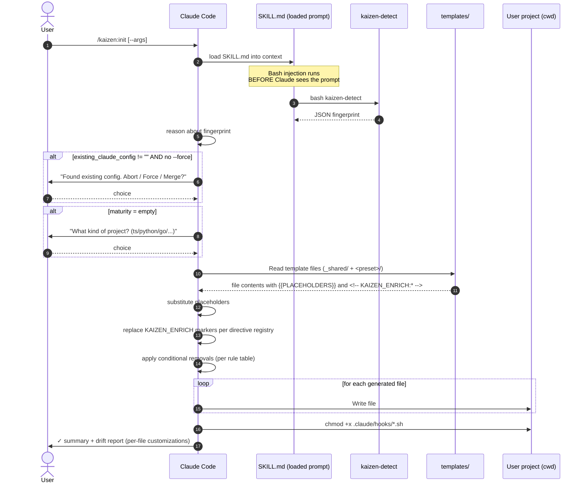

## 2. Decision tree (full)

The complete decision space of `/kaizen:init`:


## 3. Existing-config branch (detail)

The most important guard rail. kaizen **never** silently overwrites.

```mermaid
flowchart LR
    A[kaizen-detect reports<br/>existing_claude_config] --> B{Empty string?}
    B -->|yes| Continue[Continue with<br/>full scaffolding]
    B -->|no| C{--force present?}

    C -->|yes| Overwrite[Overwrite everything<br/>⚠ user explicitly asked]
    C -->|no| D[/Display list to user:<br/>'I found: CLAUDE.md, settings.json, ...']

    D --> E{User choice}
    E -->|a abort| Stop[STOP]
    E -->|b force| Overwrite
    E -->|c merge-only| Merge[Write only files<br/>that don't exist yet]
```

**Why this design**: configs are valuable user work. Silent overwrite is the worst possible failure mode for a bootstrap tool.

## 4. Maturity branch (detail)

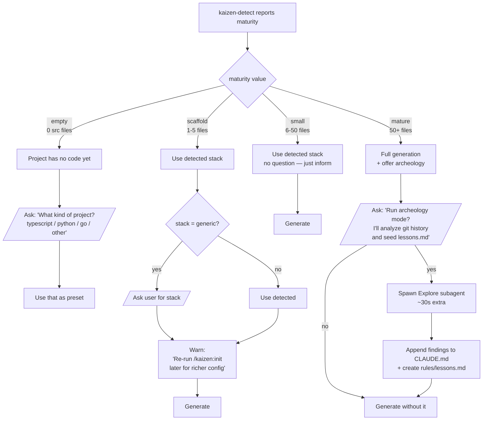

**Heuristic source**: `kaizen-detect::detect_maturity()` counts source files (`.ts`, `.py`, `.go`, `.rs`, `.java`, `.rb`, `.php`, `.ex`, `.exs`, etc.) under `cwd`, excluding `node_modules/`, `.git/`, `dist/`, `build/`, `.venv/`, `target/`, `vendor/`.

## 5. Preset selection (detail)

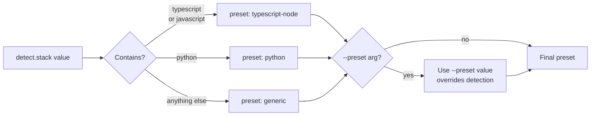

## 6. File generation matrix

What gets written by preset + flags:

| File | generic | typescript-node | python | --minimal |
|---|---|---|---|---|
| `CLAUDE.md` | ✓ | ✓ (richer) | ✓ (richer) | ✓ |
| `.claude/settings.json` | ✓ (basic perms) | ✓ (+ format hook) | ✓ (+ format hook) | ✓ |
| `.claude/settings.local.json.example` | ✓ | ✓ | ✓ | ✗ |
| `.claude/agents/code-reviewer.md` | ✓ | ✓ | ✓ | ✗ |
| `.claude/rules/testing.md` | ✗ | ✓ | ✓ | ✗ |
| `.claude/hooks/session-start.sh` | ✓ | ✓ | ✓ | ✗ |
| `.claude/hooks/format-on-save.sh` | ✗ | ✓ (prettier) | ✓ (ruff) | ✗ |
| `.gitignore` (append) | ✓ | ✓ | ✓ | ✓ |

## 6.5 Template rigidity vs flexibility (v0.2+)

After the basic substitute → write loop, kaizen v0.2 introduces a second processing step: **enrichment markers and conditional removals**. This is what keeps `/kaizen:init` adaptive without becoming non-deterministic.

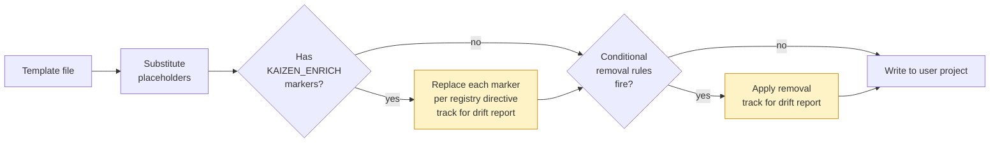

Sections of the template **outside markers** and **not matched by a conditional rule** are rigid: Claude writes them verbatim. This is enforced by SKILL.md's hard rule "NEVER modify template content outside markers and conditional rules."

The drift report at the end of `/kaizen:init` lists every action highlighted in yellow above, so the user knows exactly what got customized.

## 7. Worked scenarios

### Scenario A: empty TypeScript project

State before:

```
my-app/
└── (nothing)
```

Run `/kaizen:init`. kaizen-detect reports:

```json
{ "stack": "generic", "package_manager": "none", "maturity": "empty", ... }
```

Flow:
1. Existing config? No (empty string). Continue.
2. Maturity = `empty`. Ask user: "What stack?". User answers `typescript`.
3. Preset = `typescript-node`.
4. Read templates, substitute (`{{PROJECT_NAME}} = my-app`, `{{PACKAGE_MANAGER}} = none`, etc.).
5. Write all files.
6. Report:

```
✓ kaizen init complete

Detected: empty / typescript (chosen by you)
Preset:   typescript-node

Files created:
  - CLAUDE.md (52 lines)
  - .claude/settings.json
  - .claude/rules/testing.md
  - .claude/agents/code-reviewer.md
  - .claude/hooks/session-start.sh (chmod +x done)
  - .claude/hooks/format-on-save.sh (chmod +x done)
  - .gitignore (appended 3 lines)

Suggested next steps:
  1. Run `pnpm init` (or your PM of choice) to create package.json
  2. Re-run /kaizen:init later once you have scripts defined
  3. Try the code-reviewer agent: @code-reviewer review src/...
```

### Scenario B: small existing Python project

State before:

```
my-api/
├── pyproject.toml
├── uv.lock
├── src/myapi/__init__.py
├── src/myapi/server.py
└── tests/test_server.py
```

Run `/kaizen:init`. kaizen-detect reports:

```json
{
  "stack": "python", "package_manager": "uv", "maturity": "scaffold",
  "git": {"is_repo": true, "commits": 4, "branch": "main"},
  "existing_claude_config": "", "tests_found": 1, "ci": "none"
}
```

Flow:
1. Existing config? No. Continue.
2. Maturity = `scaffold`. Use detected stack (`python`). Warn: "Re-run later for richer config."
3. Preset = `python`.
4. Read templates, substitute (`{{PACKAGE_MANAGER}} = uv`, `{{TEST_RUNNER}} = pytest`).
5. Write all files. `settings.json` contains `Bash(uv run *)` permissions.
6. Report.

### Scenario C: mature TypeScript project with existing config

State before: 200 source files, existing `CLAUDE.md` and `.claude/settings.json`.

Run `/kaizen:init` (no `--force`):

1. Existing config? Yes (`CLAUDE.md, settings.json`).
2. **STOP**. Ask user: "I found existing config. Abort / Force / Merge-only?"
3. User picks `merge-only`.
4. Maturity = `mature`. Ask: "Run archeology mode?". User picks `yes`.
5. Spawn Explore subagent. Subagent returns: top files, test patterns, recurring fixes.
6. Read templates, substitute.
7. Write only files that don't exist (skip CLAUDE.md, skip settings.json). Create `.claude/agents/code-reviewer.md`, `.claude/rules/testing.md`, `.claude/hooks/*`, `.claude/rules/lessons.md` (from archeology).
8. Report — clearly lists what was skipped vs created.

### Scenario D: re-running after `--force`

State: kaizen was run before. User has been editing `CLAUDE.md` for two weeks. They want to start over.

Run `/kaizen:init --force`:

1. Existing config? Yes. `--force` present → skip the guard.
2. Maturity / preset as usual.
3. Overwrite everything.
4. Report includes a **warning** listing which files were overwritten.

**Recommendation**: kaizen `--force` does NOT make a backup. Users should commit before running this.

## 8. Optional archeology subagent

Only triggered on `mature` projects with explicit user opt-in. SKILL.md spawns an `Explore` subagent with a fixed prompt:

> Audit the project at `<cwd>`. Identify:
> 1. Top 10 most-modified files in last 200 commits.
> 2. Test patterns (where tests live, what they cover).
> 3. Detected architecture (layered / feature / domain).
> 4. Recurring bug patterns visible in commit messages (`fix:`, `bug:`).
>
> Return as markdown under 300 words.

**Why a subagent**: this work reads many files and would inflate the main context. Subagent returns a 300-word summary that's appended to `CLAUDE.md` and seeded into `rules/lessons.md`.

**Cost**: roughly one Claude turn worth of tokens, in a separate context window. Adds ~15-30s to the invocation.

## 9. Idempotency and re-runs

`/kaizen:init` is **safe to re-run** without arguments — it will detect existing config and stop with a prompt.

| Run | What happens |
|---|---|
| First run | Full scaffolding |
| Re-run, no args | Guards against existing config → asks user |
| Re-run with `--force` | Overwrites all |
| Re-run with merge-only choice | Adds only missing files |

There is no `--dry-run` flag in v0. Planned for v0.2.

---

# 10. `/kaizen:learn` runtime

## 10.1 Top-level sequence — analyze mode

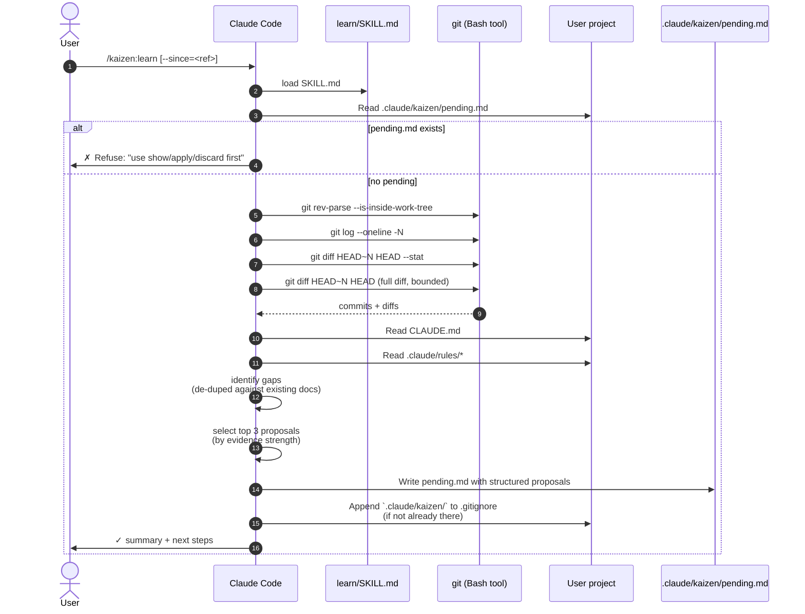

## 10.2 Top-level sequence — apply mode

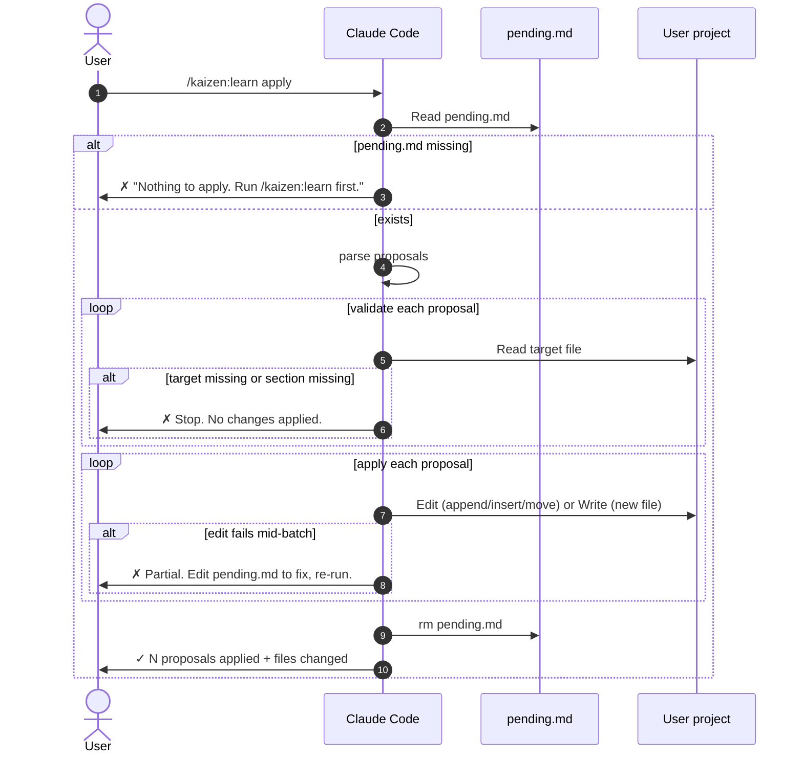

## 10.3 State machine (the core invariant)

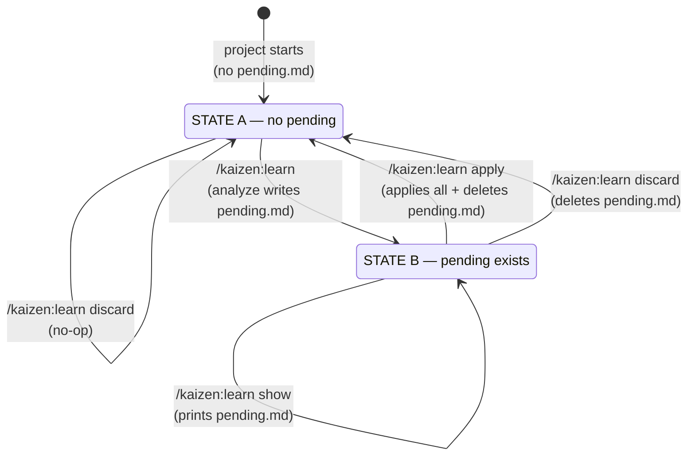

The state machine is the **single source of truth** for `/learn`'s behavior. Every command resolves to a transition. The "no auto-apply" guarantee comes from State B not having a direct edge to "files modified" without going through user-initiated `apply`.

## 10.4 Analyze mode — what gets proposed

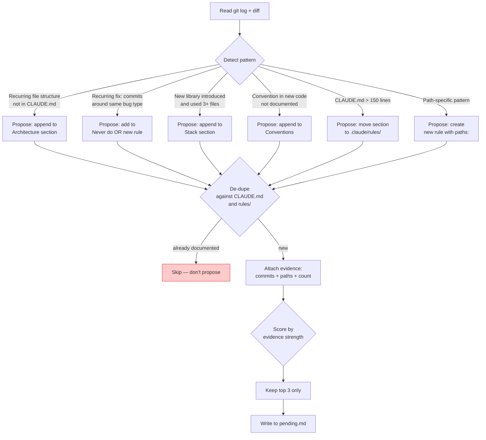

**Caps**:
- Max 3 proposals per run.
- Each must cite ≥1 commit SHA OR ≥1 file path with line(s).
- Vague "I think you should..." is not allowed.

## 10.5 Apply mode — validate before mutate

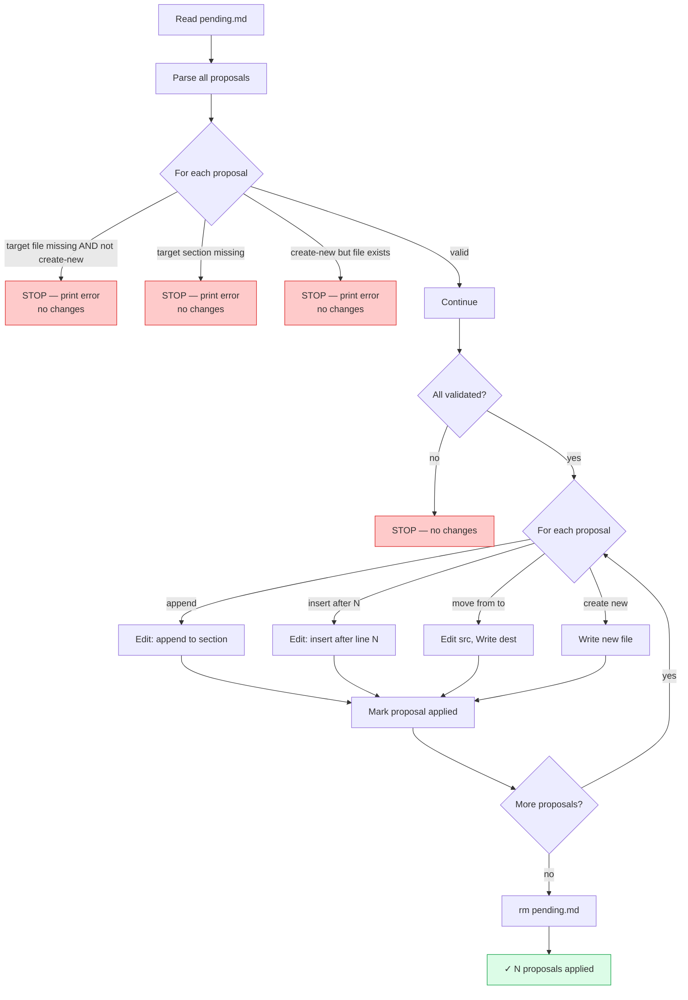

**Why validate-then-apply (not as-you-go)**: if proposal 3 has an unreachable target, we don't want proposals 1-2 already applied and 3 silently skipped. All-or-nothing on validation; best-effort rollback if a mid-apply Edit fails despite passing validation.

## 10.6 Worked scenarios for `/kaizen:learn`

### Scenario L1 — first run on an active repo

State before: project has 12 commits since CLAUDE.md was generated. No `pending.md`.

Run `/kaizen:learn`:

1. State A (no pending).
2. `git log --oneline -10` returns 10 commits.
3. `git diff HEAD~10 HEAD --stat`: 23 files changed, mostly in `src/services/` and `src/api/`.
4. Read CLAUDE.md → Architecture section mentions `src/` and `tests/`, no `services/` or `api/`.
5. Identify gaps:
   - `src/services/` appears in 8 of the 10 commits → strong signal.
   - Three commits with `fix:` messages all add null checks to API responses → recurring fix pattern.
   - `zod` was added to `package.json` in commit 4, imported in 5 files since → new library.
6. Top 3 chosen.
7. Write `pending.md` with 3 proposals + evidence each.
8. Append `.claude/kaizen/` to `.gitignore` (was not present).
9. Report:
   ```
   ✓ kaizen learn: analyzed 10 commits (HEAD~10..HEAD)

   3 proposals written to .claude/kaizen/pending.md

   Quick summary:
     1. [CLAUDE.md] Add `services/` to Architecture section
     2. [.claude/rules/api.md (new)] Path-scoped rule: null-check API responses
     3. [CLAUDE.md] Add zod to Stack section

   Next:
     /kaizen:learn show
     /kaizen:learn apply
     /kaizen:learn discard
   ```

### Scenario L2 — running again with pending

State: same project, `pending.md` exists from L1.

Run `/kaizen:learn` (no args):

1. State B.
2. Refuse:
   ```
   ✗ Pending proposals already exist at .claude/kaizen/pending.md.
     Run /kaizen:learn show to review.
     Then /kaizen:learn apply or /kaizen:learn discard.
   ```

User opens `pending.md`, deletes proposal 2 (doesn't want a new rule file), edits the wording of proposal 1.

Then runs `/kaizen:learn apply`:

1. Read `pending.md` → 2 proposals (1 + 3 from L1; 2 removed by user).
2. Validate: both targets exist. ✓
3. Apply: append to Architecture, append to Stack. Edit tool succeeds twice.
4. Delete `pending.md`.
5. Report:
   ```
   ✓ kaizen learn apply: 2 proposals applied

   Files changed:
     - CLAUDE.md: added "services/" to Architecture, added "zod" to Stack

   Next: review with `git diff CLAUDE.md`. Commit when satisfied.
   ```

### Scenario L3 — validation failure during apply

State: pending.md has 3 proposals. Between analyze and apply, user manually edited `CLAUDE.md` and removed the `## Architecture` heading (proposal 1's target).

Run `/kaizen:learn apply`:

1. Read pending.md → 3 proposals.
2. Validate proposal 1: target section `## Architecture` missing. **STOP**.
3. Report:
   ```
   ✗ Apply failed: proposal 1 targets section "## Architecture" in CLAUDE.md but that section no longer exists.
     No changes applied. Edit pending.md to fix the target section (or the file itself), then retry.
   ```

`pending.md` is preserved unchanged. User can fix and retry.

### Scenario L4 — empty analysis (nothing to propose)

State: CLAUDE.md is comprehensive; last 10 commits are all trivial typo fixes.

Run `/kaizen:learn`:

1. State A.
2. git log shows 10 commits, mostly `chore:` and `docs:`.
3. Analysis identifies no meaningful patterns (already documented or noise).
4. Write `pending.md` with `## (no proposals)`.
5. Report:
   ```
   ✓ kaizen learn: analyzed 10 commits

   No new proposals. Recent activity matches what's already documented in CLAUDE.md.

   pending.md was created (empty) and will be cleaned up on next run.
   Run /kaizen:learn discard to remove it now.
   ```

## 10.7 Idempotency

| Action | Idempotent? |
|---|---|
| `/kaizen:learn` (no args) | Effectively yes — if pending exists, refuses; if not, analyzes fresh. Re-running gives same or similar proposals from same git range. |
| `/kaizen:learn show` | Yes — pure read. |
| `/kaizen:learn apply` | No — applies and deletes. Second invocation has nothing to apply. |
| `/kaizen:learn discard` | Yes — deleting a missing file is a no-op. |
| `/kaizen:learn --since=<X>` | Yes for the same X — analysis is deterministic given inputs. (Different X gives different proposals; that's signal, not bug.) |

---

# 11. `/kaizen:analyze` runtime

## 11.1 Top-level sequence

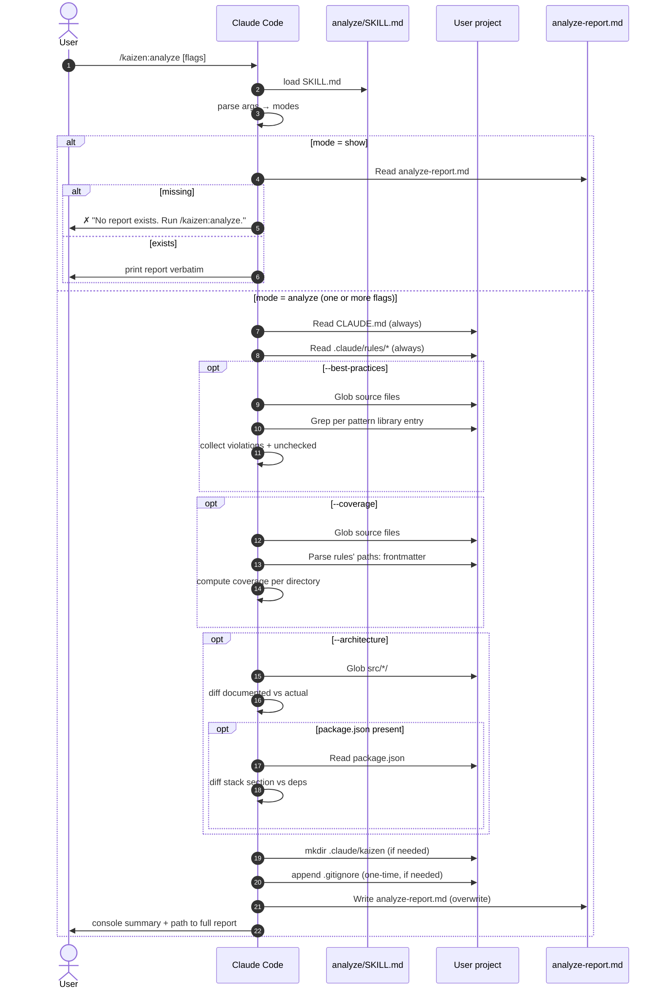

## 11.2 Decision tree (mode dispatch)


## 11.3 `--best-practices` algorithm detail

```mermaid
flowchart TD
    Start[Read CLAUDE.md + rules/*] --> Extract[Extract conventions from<br/>Conventions / Never do / Rules sections]
    Extract --> ForEach{For each<br/>convention text}

    ForEach --> Match{Match against<br/>pattern library<br/>by keyword}

    Match -->|matched| RunCheck[Run the corresponding<br/>Grep / Glob check]
    Match -->|no match| ListUnchecked[Add to 'Unchecked'<br/>section]

    RunCheck --> Results{Violations found?}
    Results -->|>0| ListViolations[List file:line entries<br/>cap at 20 with '+N more']
    Results -->|0| ListClean[Record 'no violations'<br/>(for the summary count)]

    ListViolations --> NextConv
    ListClean --> NextConv
    ListUnchecked --> NextConv

    NextConv{More conventions?}
    NextConv -->|yes| ForEach
    NextConv -->|no| Compose[Compose 'Best practices' section<br/>of the report]
```

## 11.4 `--architecture` algorithm detail

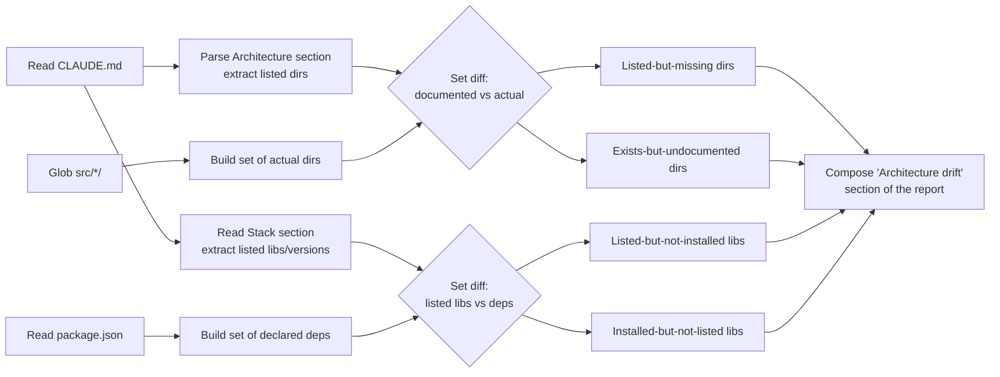

## 11.5 Worked scenarios for `/kaizen:analyze`

### Scenario A1 — first run on a project recently bootstrapped

State: CLAUDE.md generated by `/kaizen:init` a week ago. Project has been actively developed since.

Run `/kaizen:analyze` (no flags):

1. Parse args → no flags → run all three modes.
2. Read CLAUDE.md, .claude/rules/testing.md.
3. **`--best-practices`**: extract 5 conventions. 3 match the pattern library:
   - "Named exports only" → grep finds 2 violations (Vue SFCs explicitly excluded since CLAUDE.md notes the exception).
   - "No `any`" → 4 violations across 3 files.
   - "No `console.log`" → 0 violations.
   - 2 remaining conventions ("Errors are typed", "Tests next to source") added to Unchecked.
4. **`--coverage`**: project has 47 source files; only `tests/**` rule. 92% of files uncovered. Lists low-coverage dirs.
5. **`--architecture`**: CLAUDE.md lists 9 src dirs; actual src has 11. Two new dirs (`composables/`, `services/`) flagged. Stack section: 1 lib removed from package.json since last init.
6. Write report. Console:
   ```
   ✓ kaizen analyze: 3 modes run

   Findings:
     - Best practices: 6 violations across 5 files (2 unchecked)
     - Coverage: 1 directory low-coverage, 0 stale rules
     - Architecture: 0 documented-missing, 2 exists-undocumented, 1 stack drift

   Full report: .claude/kaizen/analyze-report.md
   ```

### Scenario A2 — focused single-mode run

Run `/kaizen:analyze --architecture` only:

1. Skip best-practices and coverage entirely (faster, less context).
2. Just compares Architecture + Stack against reality.
3. Report contains only the `## Architecture drift` section. Best practices / coverage sections **omitted entirely** (not "empty" — absent).
4. Console summary mentions only architecture line.

### Scenario A3 — `show` after time has passed

User ran `/kaizen:analyze` 2 days ago; comes back to the project.

Run `/kaizen:analyze show`:

1. Mode `show` is exclusive — ignores any other flags.
2. Read `.claude/kaizen/analyze-report.md`.
3. Print contents verbatim. No re-analysis.

Useful for "what did I find yesterday?" without paying for a fresh analysis.

### Scenario A4 — pattern library has no match

Edge case: user wrote CLAUDE.md with very project-specific conventions that don't match any pattern keyword.

Run `/kaizen:analyze --best-practices`:

1. Extract 6 conventions.
2. **0 match** the pattern library.
3. All 6 listed under "Unchecked (manual review)".
4. Report contains the Unchecked section + a Suggestions block: "Pattern library v0.4 covers 10 common keywords; consider rewording your conventions to match (e.g., 'Use named exports only' matches; 'Always export by name' does not)."

This is a feature: kaizen tells you what it CAN'T verify, instead of silently passing.

## 11.6 Idempotency

| Action | Idempotent? |
|---|---|
| `/kaizen:analyze` (no flags) | **Yes** — same project state gives same report. Overwrites the file. |
| `/kaizen:analyze --<modes>` | Yes for the same flags. |
| `/kaizen:analyze show` | Yes — pure read. |

Re-running is always safe. No state machine to worry about. The report file is the only output; overwriting is by design.

## 11.7 Comparison: `/kaizen:init` vs `/learn` vs `/analyze`

| Aspect | `/init` | `/learn` | `/analyze` |
|---|---|---|---|
| Direction | Forward (bootstrap from nothing) | Forward (propose new config from git history) | Backward (audit current code against existing config) |
| Reads | Project structure, package.json, kaizen-detect output | CLAUDE.md, rules, git log/diff | CLAUDE.md, rules, source files, package.json |
| Writes | Many files (CLAUDE.md, settings, rules, agents, hooks) | `pending.md` (proposals); CLAUDE.md/rules only via `apply` | `analyze-report.md` only |
| Has state machine? | No (one-shot) | Yes (no-pending ↔ has-pending) | No (one-shot) |
| Can mutate config? | Yes (always) | Yes (via `apply` subcommand only) | **Never** |
| Output drift report? | Yes (per-file) | Yes (per-proposal evidence) | The report IS the output |
| Future signal sources | More stack presets (v0.4+) | Session conversation (v0.5), auto-memory (v0.6) | `--dependencies`, `--security`, `--complexity` (v0.5+) |
