# Runtime flow — kaizen skills

> Decision trees, action sequences, and worked scenarios. Mermaid diagrams render in GitHub, VS Code (Markdown Preview Mermaid Support), and most modern markdown viewers.

**Covers eight skills (v0.10.0 — the advanced workflow scaffold release):**
- **`/kaizen:init`** — sections 1–9 below (plus profile system in section 17).
- **`/kaizen:learn`** — section 10.
- **`/kaizen:analyze`** — section 11.
- **`/kaizen:preflight`** — section 12.
- **`/kaizen:plan`** — section 13.
- **`/kaizen:docs`** — section 14 (v0.10+).
- **`/kaizen:bump`** — section 15 (v0.10+).
- **`/kaizen:finish`** — section 16 (v0.10+, the 4-agent orchestrator).

For static structure see [architecture.md](./architecture.md). For end-user instructions see [user-manual.md](./user-manual.md).

## 1. Top-level sequence

What the user sees vs. what Claude does behind the scenes:

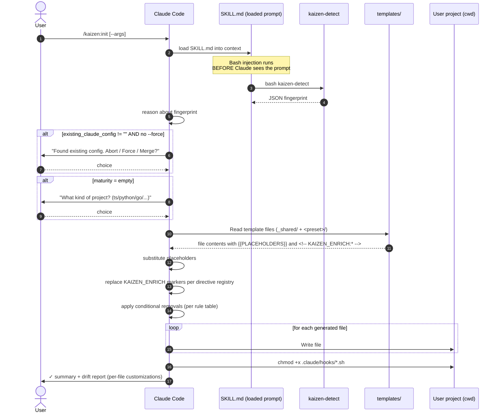
```mermaid
sequenceDiagram
    autonumber
    actor User
    participant Claude as Claude Code
    participant Skill as SKILL.md (loaded prompt)
    participant Detect as kaizen-detect
    participant Templates as templates/
    participant Project as User project (cwd)

    User->>Claude: /kaizen:init [--args]
    Claude->>Skill: load SKILL.md into context
    Note over Skill: Bash injection runs<br/>BEFORE Claude sees the prompt
    Skill->>Detect: bash kaizen-detect
    Detect-->>Skill: JSON fingerprint
    Claude->>Claude: reason about fingerprint
    alt existing_claude_config != "" AND no --force
        Claude->>User: "Found existing config. Abort / Force / Merge?"
        User-->>Claude: choice
    end
    alt maturity = empty
        Claude->>User: "What kind of project? (ts/python/go/...)"
        User-->>Claude: choice
    end
    Claude->>Templates: Read template files (_shared/ + <preset>/)
    Templates-->>Claude: file contents with {{PLACEHOLDERS}} and <!-- KAIZEN_ENRICH:* -->
    Claude->>Claude: substitute placeholders
    Claude->>Claude: replace KAIZEN_ENRICH markers per directive registry
    Claude->>Claude: apply conditional removals (per rule table)
    loop for each generated file
        Claude->>Project: Write file
    end
    Claude->>Project: chmod +x .claude/hooks/*.sh
    Claude->>User: ✓ summary + drift report (per-file customizations)
```

## 2. Decision tree (full)

The complete decision space of `/kaizen:init`:

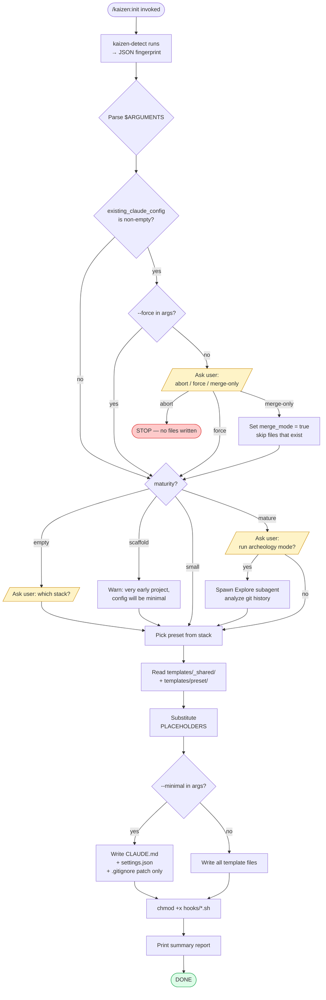
```mermaid
flowchart TD
    Start([/kaizen:init invoked]) --> Detect[kaizen-detect runs<br/>→ JSON fingerprint]
    Detect --> ParseArgs{Parse $ARGUMENTS}

    ParseArgs --> ExistingCheck{existing_claude_config<br/>is non-empty?}

    ExistingCheck -->|no| MaturityCheck{maturity?}
    ExistingCheck -->|yes| ForceCheck{--force in args?}

    ForceCheck -->|yes| MaturityCheck
    ForceCheck -->|no| AskExisting[/Ask user:<br/>abort / force / merge-only/]
    AskExisting -->|abort| End1([STOP — no files written])
    AskExisting -->|force| MaturityCheck
    AskExisting -->|merge-only| MergeMode[Set merge_mode = true<br/>skip files that exist]
    MergeMode --> MaturityCheck

    MaturityCheck -->|empty| AskStack[/Ask user: which stack?/]
    AskStack --> PickPreset

    MaturityCheck -->|scaffold| WarnEarly[Warn: very early project,<br/>config will be minimal]
    WarnEarly --> PickPreset

    MaturityCheck -->|small| PickPreset[Pick preset from stack]
    MaturityCheck -->|mature| AskArcheology[/Ask user:<br/>run archeology mode?/]

    AskArcheology -->|yes| Archeology[Spawn Explore subagent<br/>analyze git history]
    Archeology --> PickPreset
    AskArcheology -->|no| PickPreset

    PickPreset --> ReadTemplates[Read templates/_shared/<br/>+ templates/preset/]
    ReadTemplates --> Substitute[Substitute<br/>PLACEHOLDERS]
    Substitute --> MinimalCheck{--minimal in args?}

    MinimalCheck -->|yes| WriteMinimal[Write CLAUDE.md<br/>+ settings.json<br/>+ .gitignore patch only]
    MinimalCheck -->|no| WriteAll[Write all template files]

    WriteMinimal --> Chmod[chmod +x hooks/*.sh]
    WriteAll --> Chmod
    Chmod --> Report[Print summary report]
    Report --> End2([DONE])

    classDef ask fill:#fef3c7,stroke:#ca8a04;
    classDef stop fill:#fecaca,stroke:#dc2626;
    classDef done fill:#dcfce7,stroke:#16a34a;
    class AskExisting,AskStack,AskArcheology ask;
    class End1 stop;
    class End2 done;
```

## 3. Existing-config branch (detail)

The most important guard rail. kaizen **never** silently overwrites.

```mermaid
flowchart LR
    A[kaizen-detect reports<br/>existing_claude_config] --> B{Empty string?}
    B -->|yes| Continue[Continue with<br/>full scaffolding]
    B -->|no| C{--force present?}

    C -->|yes| Overwrite[Overwrite everything<br/>⚠ user explicitly asked]
    C -->|no| D[/Display list to user:<br/>'I found: CLAUDE.md, settings.json, ...']

    D --> E{User choice}
    E -->|a abort| Stop[STOP]
    E -->|b force| Overwrite
    E -->|c merge-only| Merge[Write only files<br/>that don't exist yet]
```

**Why this design**: configs are valuable user work. Silent overwrite is the worst possible failure mode for a bootstrap tool.

## 4. Maturity branch (detail)

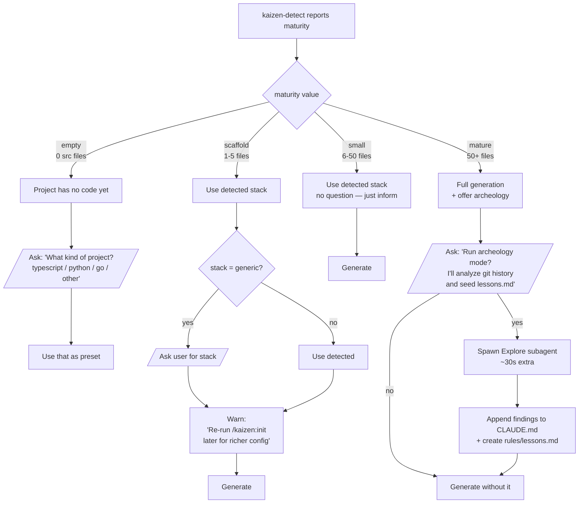
```mermaid
flowchart TD
    Start[kaizen-detect reports maturity] --> M{maturity value}

    M -->|empty<br/>0 src files| E1[Project has no code yet]
    E1 --> E2[/Ask: 'What kind of project?<br/>typescript / python / go / other'/]
    E2 --> E3[Use that as preset]

    M -->|scaffold<br/>1-5 files| S1[Use detected stack]
    S1 --> S2{stack = generic?}
    S2 -->|yes| S3[/Ask user for stack/]
    S2 -->|no| S4[Use detected]
    S3 --> S5[Warn:<br/>'Re-run /kaizen:init<br/>later for richer config']
    S4 --> S5
    S5 --> Done1[Generate]

    M -->|small<br/>6-50 files| SM1[Use detected stack<br/>no question — just inform]
    SM1 --> Done2[Generate]

    M -->|mature<br/>50+ files| MT1[Full generation<br/>+ offer archeology]
    MT1 --> MT2[/Ask: 'Run archeology mode?<br/>I'll analyze git history<br/>and seed lessons.md'/]
    MT2 -->|yes| MT3[Spawn Explore subagent<br/>~30s extra]
    MT2 -->|no| Done3[Generate without it]
    MT3 --> MT4[Append findings to CLAUDE.md<br/>+ create rules/lessons.md]
    MT4 --> Done3
```

**Heuristic source**: `kaizen-detect::detect_maturity()` counts source files (`.ts`, `.py`, `.go`, `.rs`, `.java`, `.rb`, `.php`, `.ex`, `.exs`, etc.) under `cwd`, excluding `node_modules/`, `.git/`, `dist/`, `build/`, `.venv/`, `target/`, `vendor/`.

## 5. Preset selection (detail)

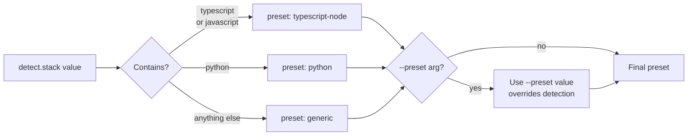
```mermaid
flowchart LR
    Start[detect.stack value] --> P{Contains?}
    P -->|typescript<br/>or javascript| TS[preset: typescript-node]
    P -->|python| PY[preset: python]
    P -->|anything else| G[preset: generic]

    TS --> Override{--preset arg?}
    PY --> Override
    G --> Override

    Override -->|yes| Use[Use --preset value<br/>overrides detection]
    Override -->|no| Final[Final preset]
    Use --> Final
```

## 6. File generation matrix

What gets written by preset + flags:

| File | generic | typescript-node | python | --minimal |
|---|---|---|---|---|
| `CLAUDE.md` | ✓ | ✓ (richer) | ✓ (richer) | ✓ |
| `.claude/settings.json` | ✓ (basic perms) | ✓ (+ format hook) | ✓ (+ format hook) | ✓ |
| `.claude/settings.local.json.example` | ✓ | ✓ | ✓ | ✗ |
| `.claude/agents/code-reviewer.md` | ✓ | ✓ | ✓ | ✗ |
| `.claude/rules/testing.md` | ✗ | ✓ | ✓ | ✗ |
| `.claude/hooks/session-start.sh` | ✓ | ✓ | ✓ | ✗ |
| `.claude/hooks/format-on-save.sh` | ✗ | ✓ (prettier) | ✓ (ruff) | ✗ |
| `.gitignore` (append) | ✓ | ✓ | ✓ | ✓ |

## 6.5 Template rigidity vs flexibility (v0.2+)

After the basic substitute → write loop, kaizen v0.2 introduces a second processing step: **enrichment markers and conditional removals**. This is what keeps `/kaizen:init` adaptive without becoming non-deterministic.

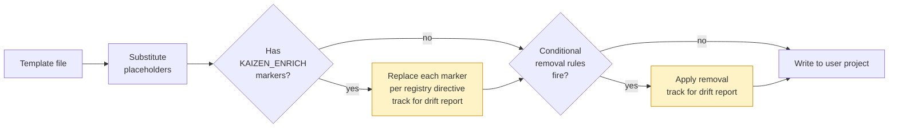
```mermaid
flowchart LR
    A[Template file] --> B[Substitute<br/>placeholders]
    B --> C{Has<br/>KAIZEN_ENRICH<br/>markers?}
    C -->|yes| D[Replace each marker<br/>per registry directive<br/>track for drift report]
    C -->|no| E
    D --> E{Conditional<br/>removal rules<br/>fire?}
    E -->|yes| F[Apply removal<br/>track for drift report]
    E -->|no| G[Write to user project]
    F --> G

    classDef tracked fill:#fef3c7,stroke:#ca8a04;
    class D,F tracked;
```

Sections of the template **outside markers** and **not matched by a conditional rule** are rigid: Claude writes them verbatim. This is enforced by SKILL.md's hard rule "NEVER modify template content outside markers and conditional rules."

The drift report at the end of `/kaizen:init` lists every action highlighted in yellow above, so the user knows exactly what got customized.

## 7. Worked scenarios

### Scenario A: empty TypeScript project

State before:

```
my-app/
└── (nothing)
```

Run `/kaizen:init`. kaizen-detect reports:

```json
{ "stack": "generic", "package_manager": "none", "maturity": "empty", ... }
```

Flow:
1. Existing config? No (empty string). Continue.
2. Maturity = `empty`. Ask user: "What stack?". User answers `typescript`.
3. Preset = `typescript-node`.
4. Read templates, substitute (`{{PROJECT_NAME}} = my-app`, `{{PACKAGE_MANAGER}} = none`, etc.).
5. Write all files.
6. Report:

```
✓ kaizen init complete

Detected: empty / typescript (chosen by you)
Preset:   typescript-node

Files created:
  - CLAUDE.md (52 lines)
  - .claude/settings.json
  - .claude/rules/testing.md
  - .claude/agents/code-reviewer.md
  - .claude/hooks/session-start.sh (chmod +x done)
  - .claude/hooks/format-on-save.sh (chmod +x done)
  - .gitignore (appended 3 lines)

Suggested next steps:
  1. Run `pnpm init` (or your PM of choice) to create package.json
  2. Re-run /kaizen:init later once you have scripts defined
  3. Try the code-reviewer agent: @code-reviewer review src/...
```

### Scenario B: small existing Python project

State before:

```
my-api/
├── pyproject.toml
├── uv.lock
├── src/myapi/__init__.py
├── src/myapi/server.py
└── tests/test_server.py
```

Run `/kaizen:init`. kaizen-detect reports:

```json
{
  "stack": "python", "package_manager": "uv", "maturity": "scaffold",
  "git": {"is_repo": true, "commits": 4, "branch": "main"},
  "existing_claude_config": "", "tests_found": 1, "ci": "none"
}
```

Flow:
1. Existing config? No. Continue.
2. Maturity = `scaffold`. Use detected stack (`python`). Warn: "Re-run later for richer config."
3. Preset = `python`.
4. Read templates, substitute (`{{PACKAGE_MANAGER}} = uv`, `{{TEST_RUNNER}} = pytest`).
5. Write all files. `settings.json` contains `Bash(uv run *)` permissions.
6. Report.

### Scenario C: mature TypeScript project with existing config

State before: 200 source files, existing `CLAUDE.md` and `.claude/settings.json`.

Run `/kaizen:init` (no `--force`):

1. Existing config? Yes (`CLAUDE.md, settings.json`).
2. **STOP**. Ask user: "I found existing config. Abort / Force / Merge-only?"
3. User picks `merge-only`.
4. Maturity = `mature`. Ask: "Run archeology mode?". User picks `yes`.
5. Spawn Explore subagent. Subagent returns: top files, test patterns, recurring fixes.
6. Read templates, substitute.
7. Write only files that don't exist (skip CLAUDE.md, skip settings.json). Create `.claude/agents/code-reviewer.md`, `.claude/rules/testing.md`, `.claude/hooks/*`, `.claude/rules/lessons.md` (from archeology).
8. Report — clearly lists what was skipped vs created.

### Scenario D: re-running after `--force`

State: kaizen was run before. User has been editing `CLAUDE.md` for two weeks. They want to start over.

Run `/kaizen:init --force`:

1. Existing config? Yes. `--force` present → skip the guard.
2. Maturity / preset as usual.
3. Overwrite everything.
4. Report includes a **warning** listing which files were overwritten.

**Recommendation**: kaizen `--force` does NOT make a backup. Users should commit before running this.

## 8. Optional archeology subagent

Only triggered on `mature` projects with explicit user opt-in. SKILL.md spawns an `Explore` subagent with a fixed prompt:

> Audit the project at `<cwd>`. Identify:
> 1. Top 10 most-modified files in last 200 commits.
> 2. Test patterns (where tests live, what they cover).
> 3. Detected architecture (layered / feature / domain).
> 4. Recurring bug patterns visible in commit messages (`fix:`, `bug:`).
>
> Return as markdown under 300 words.

**Why a subagent**: this work reads many files and would inflate the main context. Subagent returns a 300-word summary that's appended to `CLAUDE.md` and seeded into `rules/lessons.md`.

**Cost**: roughly one Claude turn worth of tokens, in a separate context window. Adds ~15-30s to the invocation.

## 9. Idempotency and re-runs

`/kaizen:init` is **safe to re-run** without arguments — it will detect existing config and stop with a prompt.

| Run | What happens |
|---|---|
| First run | Full scaffolding |
| Re-run, no args | Guards against existing config → asks user |
| Re-run with `--force` | Overwrites all |
| Re-run with merge-only choice | Adds only missing files |

There is no `--dry-run` flag in v0. Planned for v0.2.

---

# 10. `/kaizen:learn` runtime

## 10.1 Top-level sequence — analyze mode

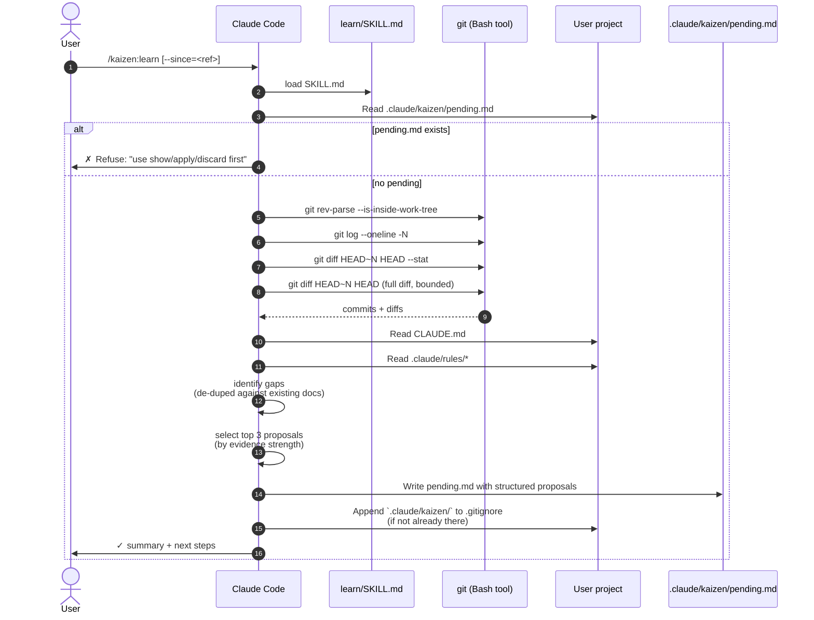
```mermaid
sequenceDiagram
    autonumber
    actor User
    participant Claude as Claude Code
    participant Skill as learn/SKILL.md
    participant Git as git (Bash tool)
    participant Project as User project
    participant Pending as .claude/kaizen/pending.md

    User->>Claude: /kaizen:learn [--since=<ref>]
    Claude->>Skill: load SKILL.md
    Claude->>Project: Read .claude/kaizen/pending.md
    alt pending.md exists
        Claude->>User: ✗ Refuse: "use show/apply/discard first"
    else no pending
        Claude->>Git: git rev-parse --is-inside-work-tree
        Claude->>Git: git log --oneline -N
        Claude->>Git: git diff HEAD~N HEAD --stat
        Claude->>Git: git diff HEAD~N HEAD (full diff, bounded)
        Git-->>Claude: commits + diffs
        Claude->>Project: Read CLAUDE.md
        Claude->>Project: Read .claude/rules/*
        Claude->>Claude: identify gaps<br/>(de-duped against existing docs)
        Claude->>Claude: select top 3 proposals<br/>(by evidence strength)
        Claude->>Pending: Write pending.md with structured proposals
        Claude->>Project: Append `.claude/kaizen/` to .gitignore<br/>(if not already there)
        Claude->>User: ✓ summary + next steps
    end
```

## 10.2 Top-level sequence — apply mode

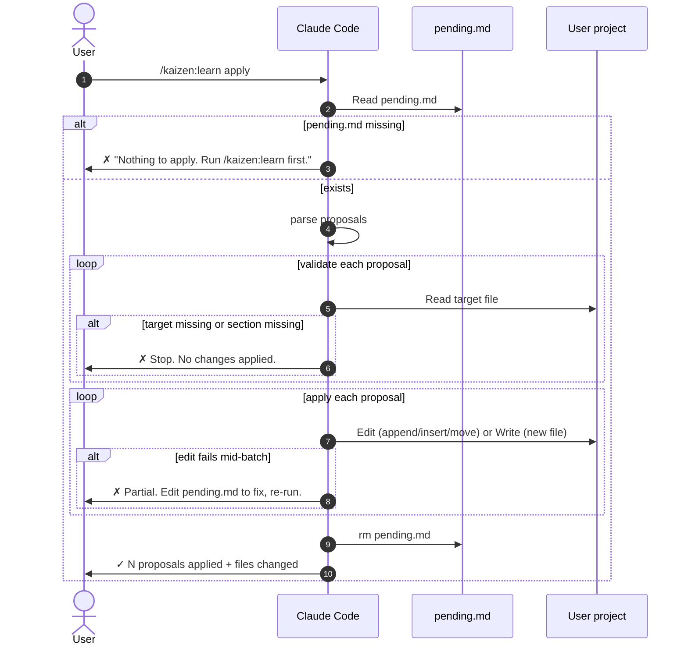
```mermaid
sequenceDiagram
    autonumber
    actor User
    participant Claude as Claude Code
    participant Pending as pending.md
    participant Project as User project

    User->>Claude: /kaizen:learn apply
    Claude->>Pending: Read pending.md
    alt pending.md missing
        Claude->>User: ✗ "Nothing to apply. Run /kaizen:learn first."
    else exists
        Claude->>Claude: parse proposals
        loop validate each proposal
            Claude->>Project: Read target file
            alt target missing or section missing
                Claude->>User: ✗ Stop. No changes applied.
            end
        end
        loop apply each proposal
            Claude->>Project: Edit (append/insert/move) or Write (new file)
            alt edit fails mid-batch
                Claude->>User: ✗ Partial. Edit pending.md to fix, re-run.
            end
        end
        Claude->>Pending: rm pending.md
        Claude->>User: ✓ N proposals applied + files changed
    end
```

## 10.3 State machine (the core invariant)

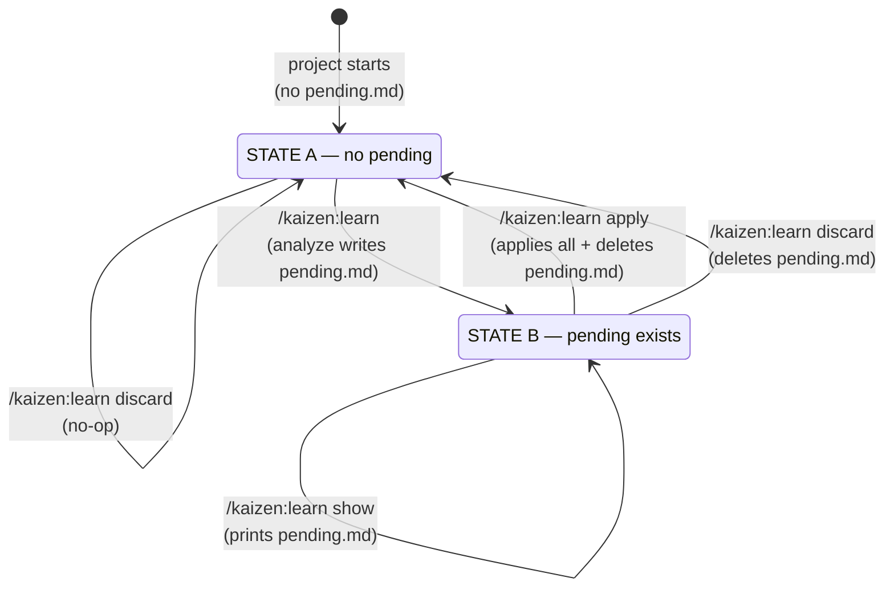
```mermaid
stateDiagram-v2
    [*] --> StateA: project starts<br/>(no pending.md)

    StateA: STATE A — no pending
    StateB: STATE B — pending exists

    StateA --> StateB: /kaizen:learn<br/>(analyze writes pending.md)
    StateA --> StateA: /kaizen:learn show<br/>(prints "no pending")
    StateA --> StateA: /kaizen:learn apply<br/>(prints "nothing to apply")
    StateA --> StateA: /kaizen:learn discard<br/>(no-op)

    StateB --> StateB: /kaizen:learn<br/>(refused — pending exists)
    StateB --> StateB: /kaizen:learn show<br/>(prints pending.md)
    StateB --> StateA: /kaizen:learn apply<br/>(applies all + deletes pending.md)
    StateB --> StateA: /kaizen:learn discard<br/>(deletes pending.md)
```

The state machine is the **single source of truth** for `/learn`'s behavior. Every command resolves to a transition. The "no auto-apply" guarantee comes from State B not having a direct edge to "files modified" without going through user-initiated `apply`.

## 10.4 Analyze mode — what gets proposed

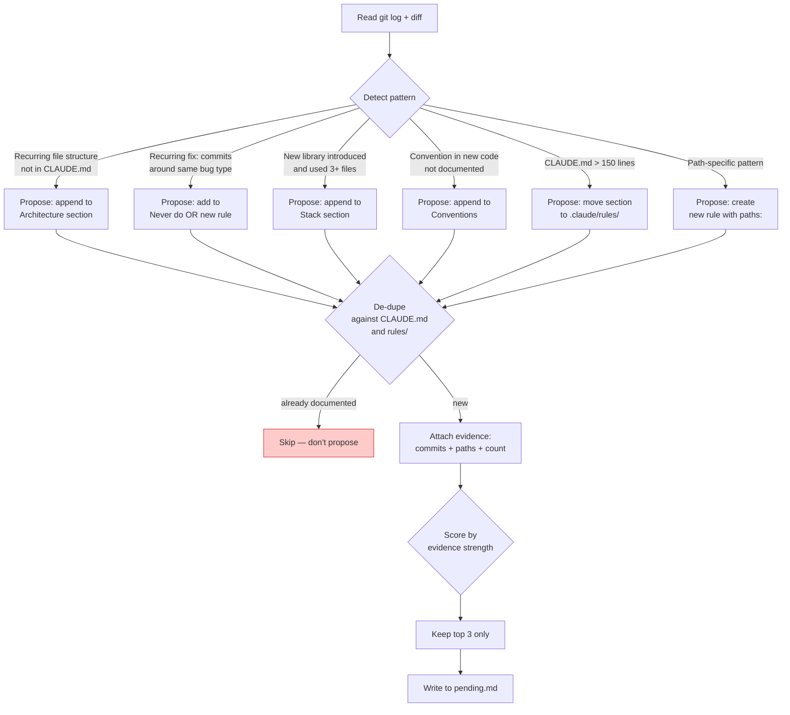
```mermaid
flowchart TD
    Start[Read git log + diff] --> Pattern{Detect pattern}

    Pattern -->|Recurring file structure<br/>not in CLAUDE.md| P1[Propose: append to<br/>Architecture section]
    Pattern -->|Recurring fix: commits<br/>around same bug type| P2[Propose: add to<br/>Never do OR new rule]
    Pattern -->|New library introduced<br/>and used 3+ files| P3[Propose: append to<br/>Stack section]
    Pattern -->|Convention in new code<br/>not documented| P4[Propose: append to<br/>Conventions]
    Pattern -->|CLAUDE.md > 150 lines| P5[Propose: move section<br/>to .claude/rules/]
    Pattern -->|Path-specific pattern| P6[Propose: create<br/>new rule with paths:]

    P1 --> Dedup{De-dupe<br/>against CLAUDE.md<br/>and rules/}
    P2 --> Dedup
    P3 --> Dedup
    P4 --> Dedup
    P5 --> Dedup
    P6 --> Dedup

    Dedup -->|already documented| Skip[Skip — don't propose]
    Dedup -->|new| Evidence[Attach evidence:<br/>commits + paths + count]

    Evidence --> Rank{Score by<br/>evidence strength}
    Rank --> Top3[Keep top 3 only]
    Top3 --> Write[Write to pending.md]

    classDef stop fill:#fecaca,stroke:#dc2626;
    class Skip stop;
```

**Caps**:
- Max 3 proposals per run.
- Each must cite ≥1 commit SHA OR ≥1 file path with line(s).
- Vague "I think you should..." is not allowed.

## 10.5 Apply mode — validate before mutate

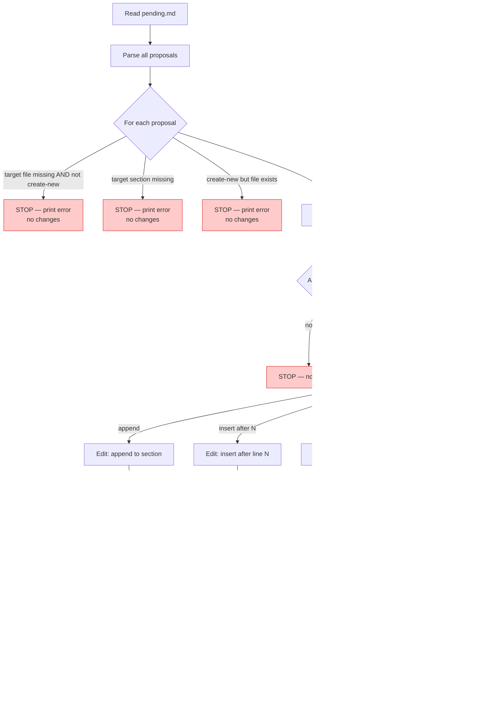
```mermaid
flowchart TD
    Start[Read pending.md] --> Parse[Parse all proposals]
    Parse --> ValidLoop{For each proposal}

    ValidLoop -->|target file missing AND not create-new| Fail1[STOP — print error<br/>no changes]
    ValidLoop -->|target section missing| Fail2[STOP — print error<br/>no changes]
    ValidLoop -->|create-new but file exists| Fail3[STOP — print error<br/>no changes]
    ValidLoop -->|valid| Continue

    Continue --> AllValid{All validated?}
    AllValid -->|no| Fail4[STOP — no changes]
    AllValid -->|yes| ApplyLoop{For each proposal}

    ApplyLoop -->|append| EditAppend[Edit: append to section]
    ApplyLoop -->|insert after N| EditInsert[Edit: insert after line N]
    ApplyLoop -->|move from to| EditMove[Edit src, Write dest]
    ApplyLoop -->|create new| WriteNew[Write new file]

    EditAppend --> Track[Mark proposal applied]
    EditInsert --> Track
    EditMove --> Track
    WriteNew --> Track

    Track --> AnyMore{More proposals?}
    AnyMore -->|yes| ApplyLoop
    AnyMore -->|no| Cleanup[rm pending.md]
    Cleanup --> Report[✓ N proposals applied]

    classDef stop fill:#fecaca,stroke:#dc2626;
    classDef ok fill:#dcfce7,stroke:#16a34a;
    class Fail1,Fail2,Fail3,Fail4 stop;
    class Report ok;
```

**Why validate-then-apply (not as-you-go)**: if proposal 3 has an unreachable target, we don't want proposals 1-2 already applied and 3 silently skipped. All-or-nothing on validation; best-effort rollback if a mid-apply Edit fails despite passing validation.

## 10.6 Worked scenarios for `/kaizen:learn`

### Scenario L1 — first run on an active repo

State before: project has 12 commits since CLAUDE.md was generated. No `pending.md`.

Run `/kaizen:learn`:

1. State A (no pending).
2. `git log --oneline -10` returns 10 commits.
3. `git diff HEAD~10 HEAD --stat`: 23 files changed, mostly in `src/services/` and `src/api/`.
4. Read CLAUDE.md → Architecture section mentions `src/` and `tests/`, no `services/` or `api/`.
5. Identify gaps:
   - `src/services/` appears in 8 of the 10 commits → strong signal.
   - Three commits with `fix:` messages all add null checks to API responses → recurring fix pattern.
   - `zod` was added to `package.json` in commit 4, imported in 5 files since → new library.
6. Top 3 chosen.
7. Write `pending.md` with 3 proposals + evidence each.
8. Append `.claude/kaizen/` to `.gitignore` (was not present).
9. Report:
   ```
   ✓ kaizen learn: analyzed 10 commits (HEAD~10..HEAD)

   3 proposals written to .claude/kaizen/pending.md

   Quick summary:
     1. [CLAUDE.md] Add `services/` to Architecture section
     2. [.claude/rules/api.md (new)] Path-scoped rule: null-check API responses
     3. [CLAUDE.md] Add zod to Stack section

   Next:
     /kaizen:learn show
     /kaizen:learn apply
     /kaizen:learn discard
   ```

### Scenario L2 — running again with pending

State: same project, `pending.md` exists from L1.

Run `/kaizen:learn` (no args):

1. State B.
2. Refuse:
   ```
   ✗ Pending proposals already exist at .claude/kaizen/pending.md.
     Run /kaizen:learn show to review.
     Then /kaizen:learn apply or /kaizen:learn discard.
   ```

User opens `pending.md`, deletes proposal 2 (doesn't want a new rule file), edits the wording of proposal 1.

Then runs `/kaizen:learn apply`:

1. Read `pending.md` → 2 proposals (1 + 3 from L1; 2 removed by user).
2. Validate: both targets exist. ✓
3. Apply: append to Architecture, append to Stack. Edit tool succeeds twice.
4. Delete `pending.md`.
5. Report:
   ```
   ✓ kaizen learn apply: 2 proposals applied

   Files changed:
     - CLAUDE.md: added "services/" to Architecture, added "zod" to Stack

   Next: review with `git diff CLAUDE.md`. Commit when satisfied.
   ```

### Scenario L3 — validation failure during apply

State: pending.md has 3 proposals. Between analyze and apply, user manually edited `CLAUDE.md` and removed the `## Architecture` heading (proposal 1's target).

Run `/kaizen:learn apply`:

1. Read pending.md → 3 proposals.
2. Validate proposal 1: target section `## Architecture` missing. **STOP**.
3. Report:
   ```
   ✗ Apply failed: proposal 1 targets section "## Architecture" in CLAUDE.md but that section no longer exists.
     No changes applied. Edit pending.md to fix the target section (or the file itself), then retry.
   ```

`pending.md` is preserved unchanged. User can fix and retry.

### Scenario L4 — empty analysis (nothing to propose)

State: CLAUDE.md is comprehensive; last 10 commits are all trivial typo fixes.

Run `/kaizen:learn`:

1. State A.
2. git log shows 10 commits, mostly `chore:` and `docs:`.
3. Analysis identifies no meaningful patterns (already documented or noise).
4. Write `pending.md` with `## (no proposals)`.
5. Report:
   ```
   ✓ kaizen learn: analyzed 10 commits

   No new proposals. Recent activity matches what's already documented in CLAUDE.md.

   pending.md was created (empty) and will be cleaned up on next run.
   Run /kaizen:learn discard to remove it now.
   ```

## 10.7 Idempotency

| Action | Idempotent? |
|---|---|
| `/kaizen:learn` (no args) | Effectively yes — if pending exists, refuses; if not, analyzes fresh. Default range `HEAD~10..HEAD`. |
| `/kaizen:learn show` | Yes — pure read. |
| `/kaizen:learn apply` | No — applies and deletes. Second invocation has nothing to apply. |
| `/kaizen:learn discard` | Yes — deleting a missing file is a no-op. |
| `/kaizen:learn --since=<X>` | Yes for the same X — analysis is deterministic given inputs. |
| `/kaizen:learn --limit=<N>` | Yes for the same N — equivalent to `--since=HEAD~<N>`. v0.7+. |

---

# 11. `/kaizen:analyze` runtime

## 11.1 Top-level sequence

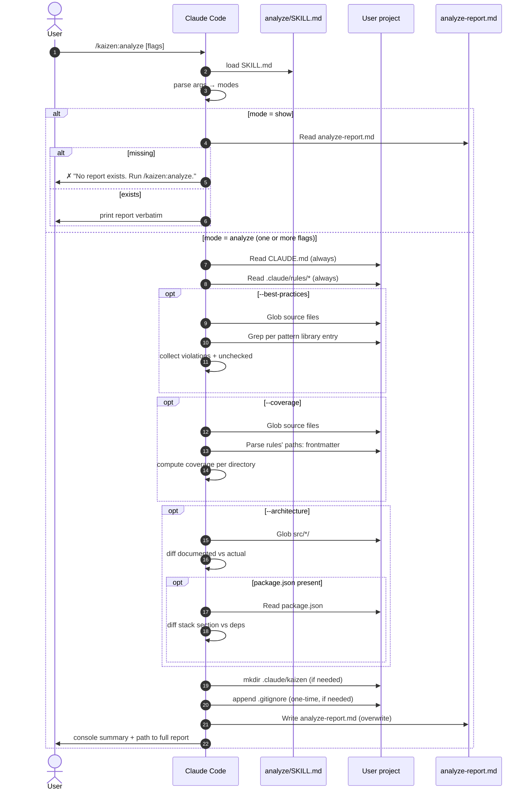
```mermaid
sequenceDiagram
    autonumber
    actor User
    participant Claude as Claude Code
    participant Skill as analyze/SKILL.md
    participant Project as User project
    participant Report as analyze-report.md

    User->>Claude: /kaizen:analyze [flags]
    Claude->>Skill: load SKILL.md
    Claude->>Claude: parse args → modes
    alt mode = show
        Claude->>Report: Read analyze-report.md
        alt missing
            Claude->>User: ✗ "No report exists. Run /kaizen:analyze."
        else exists
            Claude->>User: print report verbatim
        end
    else mode = analyze (one or more flags)
        Claude->>Project: Read CLAUDE.md (always)
        Claude->>Project: Read .claude/rules/* (always)
        opt --best-practices
            Claude->>Project: Glob source files
            Claude->>Project: Grep per pattern library entry
            Claude->>Claude: collect violations + unchecked
        end
        opt --coverage
            Claude->>Project: Glob source files
            Claude->>Project: Parse rules' paths: frontmatter
            Claude->>Claude: compute coverage per directory
        end
        opt --architecture
            Claude->>Project: Glob src/*/
            Claude->>Claude: diff documented vs actual
            opt package.json present
                Claude->>Project: Read package.json
                Claude->>Claude: diff stack section vs deps
            end
        end
        Claude->>Project: mkdir .claude/kaizen (if needed)
        Claude->>Project: append .gitignore (one-time, if needed)
        Claude->>Report: Write analyze-report.md (overwrite)
        Claude->>User: console summary + path to full report
    end
```

## 11.2 Decision tree (mode dispatch)

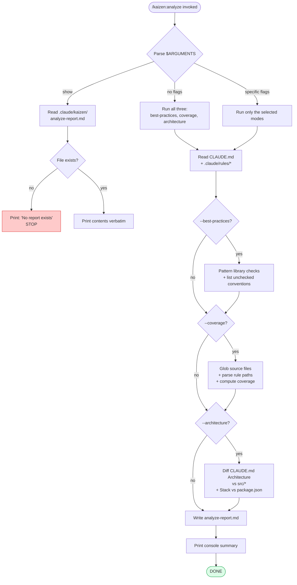
```mermaid
flowchart TD
    Start([/kaizen:analyze invoked]) --> ParseArgs{Parse $ARGUMENTS}

    ParseArgs -->|show| Show[Read .claude/kaizen/<br/>analyze-report.md]
    Show --> ShowExists{File exists?}
    ShowExists -->|no| ShowMiss[Print: 'No report exists'<br/>STOP]
    ShowExists -->|yes| ShowPrint[Print contents verbatim]

    ParseArgs -->|no flags| AllModes[Run all three:<br/>best-practices, coverage, architecture]
    ParseArgs -->|specific flags| SelectedModes[Run only the selected modes]

    AllModes --> ReadDocs[Read CLAUDE.md<br/>+ .claude/rules/*]
    SelectedModes --> ReadDocs

    ReadDocs --> BP{--best-practices?}
    BP -->|yes| BPRun[Pattern library checks<br/>+ list unchecked conventions]
    BP -->|no| COV
    BPRun --> COV

    COV{--coverage?}
    COV -->|yes| COVRun[Glob source files<br/>+ parse rule paths<br/>+ compute coverage]
    COV -->|no| ARCH
    COVRun --> ARCH

    ARCH{--architecture?}
    ARCH -->|yes| ARCHRun[Diff CLAUDE.md Architecture<br/>vs src/*<br/>+ Stack vs package.json]
    ARCH -->|no| Write
    ARCHRun --> Write

    Write[Write analyze-report.md] --> Print[Print console summary]
    Print --> Done([DONE])

    classDef stop fill:#fecaca,stroke:#dc2626;
    classDef done fill:#dcfce7,stroke:#16a34a;
    class ShowMiss stop;
    class Done done;
```

## 11.3 `--best-practices` algorithm detail

```mermaid
flowchart TD
    Start[Read CLAUDE.md + rules/*] --> Extract[Extract conventions from<br/>Conventions / Never do / Rules sections]
    Extract --> ForEach{For each<br/>convention text}

    ForEach --> Match{Match against<br/>pattern library<br/>by keyword}

    Match -->|matched| RunCheck[Run the corresponding<br/>Grep / Glob check]
    Match -->|no match| ListUnchecked[Add to 'Unchecked'<br/>section]

    RunCheck --> Results{Violations found?}
    Results -->|>0| ListViolations[List file:line entries<br/>cap at 20 with '+N more']
    Results -->|0| ListClean[Record 'no violations'<br/>(for the summary count)]

    ListViolations --> NextConv
    ListClean --> NextConv
    ListUnchecked --> NextConv

    NextConv{More conventions?}
    NextConv -->|yes| ForEach
    NextConv -->|no| Compose[Compose 'Best practices' section<br/>of the report]
```

## 11.4 `--architecture` algorithm detail

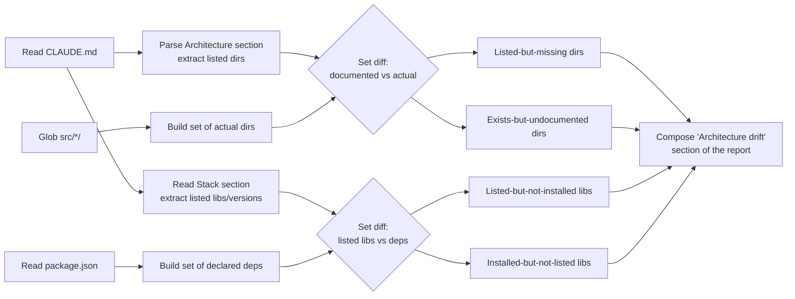
```mermaid
flowchart LR
    A[Read CLAUDE.md] --> B[Parse Architecture section<br/>extract listed dirs]
    A --> C[Read Stack section<br/>extract listed libs/versions]
    D[Glob src/*/] --> E[Build set of actual dirs]
    F[Read package.json] --> G[Build set of declared deps]

    B --> Diff1{Set diff:<br/>documented vs actual}
    E --> Diff1

    C --> Diff2{Set diff:<br/>listed libs vs deps}
    G --> Diff2

    Diff1 --> Out1[Listed-but-missing dirs]
    Diff1 --> Out2[Exists-but-undocumented dirs]

    Diff2 --> Out3[Listed-but-not-installed libs]
    Diff2 --> Out4[Installed-but-not-listed libs]

    Out1 --> Compose[Compose 'Architecture drift'<br/>section of the report]
    Out2 --> Compose
    Out3 --> Compose
    Out4 --> Compose
```

## 11.5 Worked scenarios for `/kaizen:analyze`

### Scenario A1 — first run on a project recently bootstrapped

State: CLAUDE.md generated by `/kaizen:init` a week ago. Project has been actively developed since.

Run `/kaizen:analyze` (no flags):

1. Parse args → no flags → run all three modes.
2. Read CLAUDE.md, .claude/rules/testing.md.
3. **`--best-practices`**: extract 5 conventions. 3 match the pattern library:
   - "Named exports only" → grep finds 2 violations (Vue SFCs explicitly excluded since CLAUDE.md notes the exception).
   - "No `any`" → 4 violations across 3 files.
   - "No `console.log`" → 0 violations.
   - 2 remaining conventions ("Errors are typed", "Tests next to source") added to Unchecked.
4. **`--coverage`**: project has 47 source files; only `tests/**` rule. 92% of files uncovered. Lists low-coverage dirs.
5. **`--architecture`**: CLAUDE.md lists 9 src dirs; actual src has 11. Two new dirs (`composables/`, `services/`) flagged. Stack section: 1 lib removed from package.json since last init.
6. Write report. Console:
   ```
   ✓ kaizen analyze: 3 modes run

   Findings:
     - Best practices: 6 violations across 5 files (2 unchecked)
     - Coverage: 1 directory low-coverage, 0 stale rules
     - Architecture: 0 documented-missing, 2 exists-undocumented, 1 stack drift

   Full report: .claude/kaizen/analyze-report.md
   ```

### Scenario A2 — focused single-mode run

Run `/kaizen:analyze --architecture` only:

1. Skip best-practices and coverage entirely (faster, less context).
2. Just compares Architecture + Stack against reality.
3. Report contains only the `## Architecture drift` section. Best practices / coverage sections **omitted entirely** (not "empty" — absent).
4. Console summary mentions only architecture line.

### Scenario A3 — `show` after time has passed

User ran `/kaizen:analyze` 2 days ago; comes back to the project.

Run `/kaizen:analyze show`:

1. Mode `show` is exclusive — ignores any other flags.
2. Read `.claude/kaizen/analyze-report.md`.
3. Print contents verbatim. No re-analysis.

Useful for "what did I find yesterday?" without paying for a fresh analysis.

### Scenario A4 — pattern library has no match

Edge case: user wrote CLAUDE.md with very project-specific conventions that don't match any pattern keyword.

Run `/kaizen:analyze --best-practices`:

1. Extract 6 conventions.
2. **0 match** the pattern library.
3. All 6 listed under "Unchecked (manual review)".
4. Report contains the Unchecked section + a Suggestions block: "Pattern library v0.4 covers 10 common keywords; consider rewording your conventions to match (e.g., 'Use named exports only' matches; 'Always export by name' does not)."

This is a feature: kaizen tells you what it CAN'T verify, instead of silently passing.

## 11.6 Idempotency

| Action | Idempotent? |
|---|---|
| `/kaizen:analyze` (no flags) | **Yes** — same project state gives same report. Overwrites the file. |
| `/kaizen:analyze --<modes>` | Yes for the same flags. |
| `/kaizen:analyze show` | Yes — pure read. |

Re-running is always safe. No state machine to worry about. The report file is the only output; overwriting is by design.

## 11.7 Comparison: `/kaizen:init` vs `/learn` vs `/analyze`

| Aspect | `/init` | `/learn` | `/analyze` |
|---|---|---|---|
| Direction | Forward (bootstrap from nothing) | Forward (propose new config from git history) | Backward (audit current code against existing config) |
| Reads | Project structure, package.json, kaizen-detect output | CLAUDE.md, rules, git log/diff | CLAUDE.md, rules, source files, package.json |
| Writes | Many files (CLAUDE.md, settings, rules, agents, hooks) | `pending.md` (proposals); CLAUDE.md/rules only via `apply` | `analyze-report.md` only |
| Has state machine? | No (one-shot) | Yes (no-pending ↔ has-pending) | No (one-shot) |
| Can mutate config? | Yes (always) | Yes (via `apply` subcommand only) | **Never** |
| Output drift report? | Yes (per-file) | Yes (per-proposal evidence) | The report IS the output |
| Future signal sources | More stack presets (v0.4+) | Session conversation (v0.5), auto-memory (v0.6) | `--dependencies`, `--security`, `--complexity` (v0.5+) |

---

# 12. `/kaizen:preflight` runtime

## 12.1 Top-level sequence (full run)

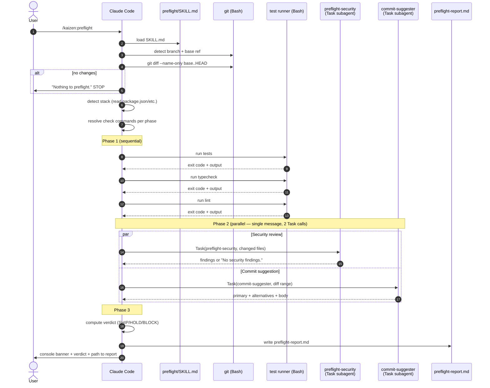
```mermaid
sequenceDiagram
    autonumber
    actor User
    participant Claude as Claude Code
    participant Skill as preflight/SKILL.md
    participant Git as git (Bash)
    participant Test as test runner (Bash)
    participant Sec as preflight-security<br/>(Task subagent)
    participant Commit as commit-suggester<br/>(Task subagent)
    participant Report as preflight-report.md

    User->>Claude: /kaizen:preflight
    Claude->>Skill: load SKILL.md
    Claude->>Git: detect branch + base ref
    Claude->>Git: git diff --name-only base..HEAD
    alt no changes
        Claude->>User: "Nothing to preflight." STOP
    end
    Claude->>Claude: detect stack (read package.json/etc.)
    Claude->>Claude: resolve check commands per phase

    Note over Claude: Phase 1 (sequential)
    Claude->>Test: run tests
    Test-->>Claude: exit code + output
    Claude->>Test: run typecheck
    Test-->>Claude: exit code + output
    Claude->>Test: run lint
    Test-->>Claude: exit code + output

    Note over Claude,Commit: Phase 2 (parallel — single message, 2 Task calls)
    par Security review
        Claude->>Sec: Task(preflight-security, changed files)
        Sec-->>Claude: findings or "No security findings."
    and Commit suggestion
        Claude->>Commit: Task(commit-suggester, diff range)
        Commit-->>Claude: primary + alternatives + body
    end

    Note over Claude: Phase 3
    Claude->>Claude: compute verdict (SHIP/HOLD/BLOCK)
    Claude->>Report: write preflight-report.md
    Claude->>User: console banner + verdict + path to report
```

The **`par` block** is the key new pattern: two Task calls dispatched in a single message run in parallel.

## 12.2 Phase decomposition

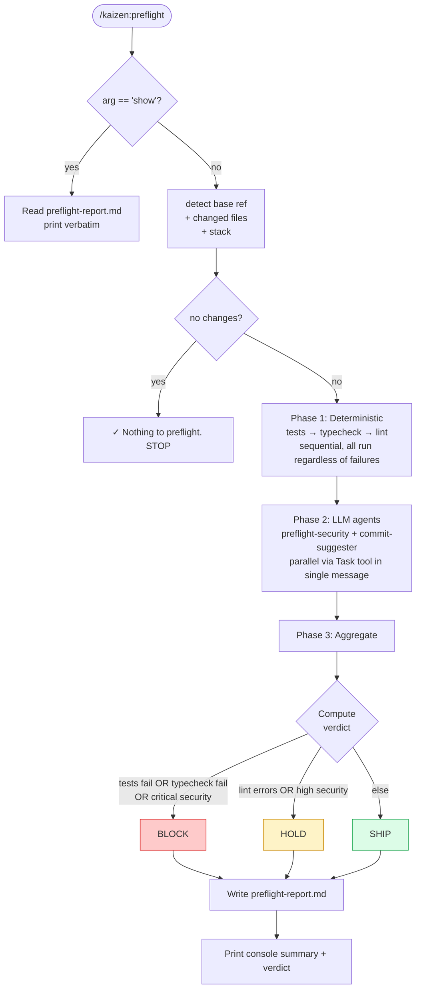
```mermaid
flowchart TD
    Start([/kaizen:preflight]) --> Show{arg == 'show'?}
    Show -->|yes| ShowFile[Read preflight-report.md<br/>print verbatim]
    Show -->|no| Detect[detect base ref<br/>+ changed files<br/>+ stack]

    Detect --> Empty{no changes?}
    Empty -->|yes| Stop[✓ Nothing to preflight. STOP]
    Empty -->|no| Phase1

    Phase1[Phase 1: Deterministic<br/>tests → typecheck → lint<br/>sequential, all run regardless of failures]
    Phase1 --> Phase2

    Phase2[Phase 2: LLM agents<br/>preflight-security + commit-suggester<br/>parallel via Task tool in single message]
    Phase2 --> Aggregate

    Aggregate[Phase 3: Aggregate]
    Aggregate --> VerdictCalc{Compute<br/>verdict}

    VerdictCalc -->|tests fail OR typecheck fail<br/>OR critical security| Block[BLOCK]
    VerdictCalc -->|lint errors OR high security| Hold[HOLD]
    VerdictCalc -->|else| Ship[SHIP]

    Block --> Write[Write preflight-report.md]
    Hold --> Write
    Ship --> Write
    Write --> Print[Print console summary + verdict]

    classDef stop fill:#fecaca,stroke:#dc2626;
    classDef warn fill:#fef3c7,stroke:#ca8a04;
    classDef ok fill:#dcfce7,stroke:#16a34a;
    class Block stop;
    class Hold warn;
    class Ship ok;
```

## 12.3 Verdict decision logic

The verdict is computed by a deterministic decision tree, NOT by an LLM. The agents return findings; the orchestrator classifies them.

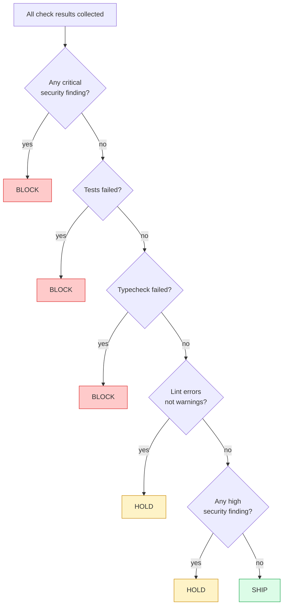
```mermaid
flowchart TD
    Start[All check results collected] --> Critical{Any critical<br/>security finding?}
    Critical -->|yes| Block1[BLOCK]
    Critical -->|no| TestsFail{Tests failed?}
    TestsFail -->|yes| Block2[BLOCK]
    TestsFail -->|no| TypeFail{Typecheck failed?}
    TypeFail -->|yes| Block3[BLOCK]
    TypeFail -->|no| LintErr{Lint errors<br/>not warnings?}

    LintErr -->|yes| Hold1[HOLD]
    LintErr -->|no| HighSec{Any high<br/>security finding?}
    HighSec -->|yes| Hold2[HOLD]
    HighSec -->|no| Ship[SHIP]

    classDef stop fill:#fecaca,stroke:#dc2626;
    classDef warn fill:#fef3c7,stroke:#ca8a04;
    classDef ok fill:#dcfce7,stroke:#16a34a;
    class Block1,Block2,Block3 stop;
    class Hold1,Hold2 warn;
    class Ship ok;
```

**Skipped checks** (no tooling installed) are reported but **never** affect the verdict.

## 12.4 Base ref detection (subtree)

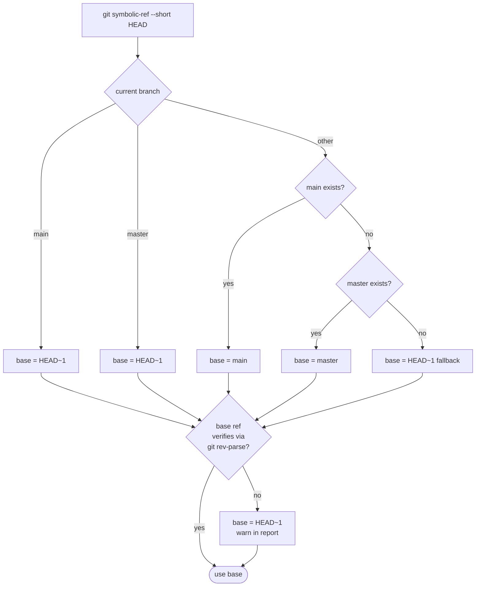
```mermaid
flowchart TD
    Start[git symbolic-ref --short HEAD] --> Branch{current branch}
    Branch -->|main| UseHead1a[base = HEAD~1]
    Branch -->|master| UseHead1b[base = HEAD~1]
    Branch -->|other| TryMain{main exists?}

    TryMain -->|yes| UseMain[base = main]
    TryMain -->|no| TryMaster{master exists?}
    TryMaster -->|yes| UseMaster[base = master]
    TryMaster -->|no| Fallback[base = HEAD~1 fallback]

    UseHead1a --> Verify
    UseHead1b --> Verify
    UseMain --> Verify
    UseMaster --> Verify
    Fallback --> Verify

    Verify{base ref<br/>verifies via<br/>git rev-parse?}
    Verify -->|yes| Done([use base])
    Verify -->|no| FallbackFinal[base = HEAD~1<br/>warn in report]
    FallbackFinal --> Done
```

The chosen base ref is recorded in the report header so the user knows what was compared against.

## 12.5 The parallel-Task pattern (architectural primer)

This skill introduces the multi-agent dispatch pattern to kaizen. The mechanism is simple but important.

**Sequential** (what we DON'T do):

```
Claude → Task(A) → wait → Task(B) → wait → continue
```

Total time: T(A) + T(B).

**Parallel** (what `/preflight` Phase 2 does):

```
Claude → [Task(A), Task(B)] (single message) → wait for both → continue
```

Total time: max(T(A), T(B)) — usually ~2× faster.

The unlock: Claude Code schedules tool calls within a single message in parallel when they're independent. Two Task calls in the same response = two subagents in fresh contexts running simultaneously.

**Why kaizen waited until `/preflight` to use this**: `/init`, `/learn`, `/analyze` are all one-job-per-invocation skills. Their "parallelism" would be artificial. `/preflight` genuinely has two independent reasoning tasks (security review, commit message) that benefit from concurrent execution.

This pattern will scale to `/plan` (v0.6+ planned), which will likely dispatch multiple research subagents for different parts of a spec doc.

## 12.6 Worked scenarios

### Scenario P1 — clean change, SHIP verdict

State: feature branch `feat/zod-validation`, 4 files changed since `main`. All checks pass; security agent finds nothing; commit-suggester proposes a good message.

Run `/kaizen:preflight`:

1. Base ref detected: `main`.
2. 4 changed files (3 source, 1 doc).
3. Phase 1: tests pass (47/47), typecheck pass (0 errors), lint pass (0 errors, 2 warnings).
4. Phase 2 (parallel): security returns "No security findings."; commit-suggester returns `feat(api): add zod validation`.
5. Verdict: SHIP.
6. Report written. Console:
   ```
   ╔════════════════════════╗
   ║  PREFLIGHT — SHIP ✓    ║
   ║  0c · 0h · 0m · 0l     ║
   ╚════════════════════════╝

   ✓ Tests       (47 passed, 0 failed)
   ✓ Typecheck   (0 errors)
   ⚠ Lint        (0e, 2w)
   ✓ Security    (No findings)
   ℹ Commit msg  (feat(api): add zod validation)

   Verdict: SHIP. Ready to commit.
   ```

### Scenario P2 — critical security finding, BLOCK verdict

Same project state, but one of the changed files added a hardcoded API token.

1-3. Same as P1: all deterministic checks pass.
4. Phase 2: security agent finds `[critical] src/api/auth.ts:42 — hardcoded API token`. Commit-suggester still returns a message.
5. Verdict: BLOCK (critical security → automatic BLOCK regardless of other checks).
6. Console:
   ```
   ╔════════════════════════╗
   ║  PREFLIGHT — BLOCK ✗   ║
   ║  1c · 0h · 0m · 0l     ║
   ╚════════════════════════╝

   ✓ Tests       (47 passed, 0 failed)
   ✓ Typecheck   (0 errors)
   ⚠ Lint        (0e, 2w)
   ✗ Security    (1 critical finding)
   ℹ Commit msg  (feat(api): add zod validation)

   Verdict: BLOCK. 1 critical security finding must be resolved.
   ```

### Scenario P3 — agent failure, partial result

Same setup, but the `commit-suggester` agent fails (e.g., diff too large, internal error).

1-3. Same. Deterministic checks complete.
4. Phase 2: security returns findings normally; commit-suggester returns an error/garbled output.
5. Orchestrator logs the commit-suggester failure in the report; verdict computed from the successful parts (tests, typecheck, lint, security).
6. Console includes the deterministic + security results normally; commit msg line says `(unavailable — see report)`.

This way one agent failing doesn't kill the whole preflight.

### Scenario P4 — `show` after a previous run

User ran `/kaizen:preflight` 30 min ago, wants to re-read the report.

Run `/kaizen:preflight show`:

1. Read `.claude/kaizen/preflight-report.md`. If present, print verbatim. No phases run. No agents spawned. Instant.

### Scenario P5 — no changes since base

User on `feat/xyz` branch, but hasn't committed anything new since branching from `main`.

1. Base ref: `main`.
2. `git diff --name-only main..HEAD` returns empty.
3. Print `✓ No changes since main. Nothing to preflight.`
4. **No report written.** No agents spawned. Exit.

## 12.7 Idempotency

| Action | Idempotent? |
|---|---|
| `/kaizen:preflight` | Yes for the same git state. Re-running on unchanged repo gives same verdict and similar agent outputs. |
| `/kaizen:preflight show` | Yes — pure read. |
| `/kaizen:preflight --base=<X>` | Yes for the same X. v0.8+. |
| `/kaizen:preflight --skip=<list>` | Yes for the same list. v0.8+. Skipped checks always show as `skipped (--skip)`. |
| `/kaizen:preflight --auto-fix` | **No** — modifies source files. After the first run, the second run starts from the auto-fixed state. v0.8+. |

Re-runs are encouraged — after fixing issues, run again to confirm SHIP. Cheap and stateless.

## 12.8 Token cost characterization

Approximate cost breakdown (assumes Sonnet for both agents):

| Phase | Tokens | Notes |
|---|---|---|
| Orchestrator setup | ~1k | SKILL.md load + reasoning over args |
| Phase 1 commands | ~0 | Bash output goes to context but isn't billed as model input |
| Phase 1 result parsing | ~1-5k | Depending on output size (bounded to 50 lines/check) |
| Phase 2 — security agent | ~5-20k | Depends on changed-file size; bounded by file count |
| Phase 2 — commit-suggester | ~3-10k | Depends on diff size |
| Phase 3 aggregation + report | ~2k | Writing the report markdown |

**Total per preflight**: roughly 12k-40k tokens. The dominant cost is Phase 2 agents; the changed-files-only scoping is what keeps this bounded.

For a 20-file diff in a TypeScript repo, expect ~15-25k tokens total. The deterministic phase has no model cost beyond parsing.

## 12.9 Comparison with other kaizen skills

| Aspect | `/init` | `/learn` | `/analyze` | `/preflight` |
|---|---|---|---|---|
| Trigger | Once per project | After tasks finish | When curious | Before commit/PR |
| Reads | Project files, package.json | git log/diff, CLAUDE.md | All source + config | Git state, package.json, changed files |
| Writes | Many config files | `pending.md`, optionally config | `analyze-report.md` only | `preflight-report.md` only |
| State machine | No | Yes (pending) | No | No |
| Can mutate config | Yes | Yes (via apply) | Never | Never |
| Subagents spawned | Optional (archeology) | None | None | **2, in parallel** |
| Token cost | High (multi-file generation) | Medium (per analysis) | Low–medium | Medium (bounded by diff size) |
| Run frequency | 1× project lifetime | Weekly / per sprint | Ad hoc | Every PR/commit candidate |
| Verdict output | Drift report | Proposals | Findings | **SHIP/HOLD/BLOCK** |

---

# 13. `/kaizen:plan` runtime

## 13.1 Top-level sequence (full run)

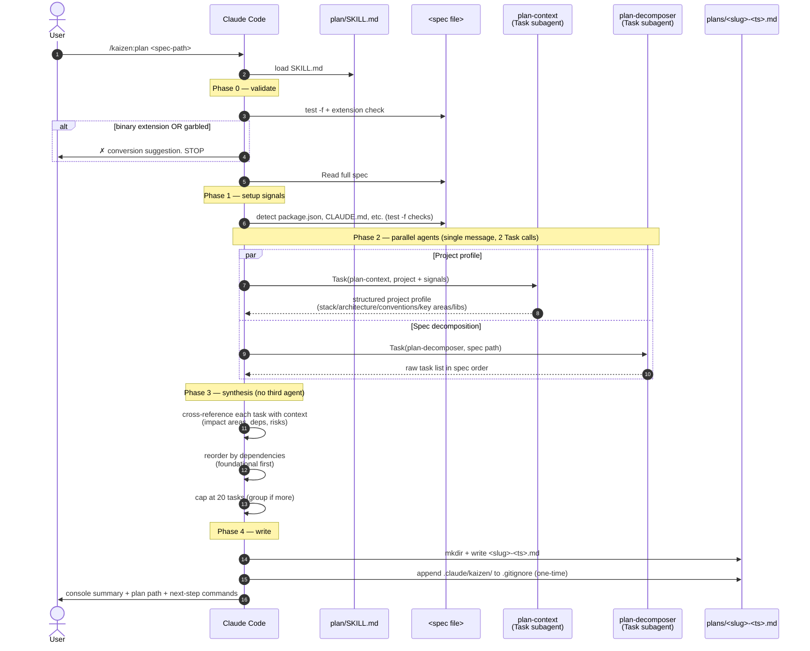
```mermaid
sequenceDiagram
    autonumber
    actor User
    participant Claude as Claude Code
    participant Skill as plan/SKILL.md
    participant Spec as <spec file>
    participant Ctx as plan-context<br/>(Task subagent)
    participant Decomp as plan-decomposer<br/>(Task subagent)
    participant Plan as plans/<slug>-<ts>.md

    User->>Claude: /kaizen:plan <spec-path>
    Claude->>Skill: load SKILL.md

    Note over Claude: Phase 0 — validate
    Claude->>Spec: test -f + extension check
    alt binary extension OR garbled
        Claude->>User: ✗ conversion suggestion. STOP
    end
    Claude->>Spec: Read full spec

    Note over Claude: Phase 1 — setup signals
    Claude->>Spec: detect package.json, CLAUDE.md, etc. (test -f checks)

    Note over Claude,Decomp: Phase 2 — parallel agents (single message, 2 Task calls)
    par Project profile
        Claude->>Ctx: Task(plan-context, project + signals)
        Ctx-->>Claude: structured project profile<br/>(stack/architecture/conventions/key areas/libs)
    and Spec decomposition
        Claude->>Decomp: Task(plan-decomposer, spec path)
        Decomp-->>Claude: raw task list in spec order
    end

    Note over Claude: Phase 3 — synthesis (no third agent)
    Claude->>Claude: cross-reference each task with context<br/>(impact areas, deps, risks)
    Claude->>Claude: reorder by dependencies<br/>(foundational first)
    Claude->>Claude: cap at 20 tasks (group if more)

    Note over Claude: Phase 4 — write
    Claude->>Plan: mkdir + write <slug>-<ts>.md
    Claude->>Plan: append .claude/kaizen/ to .gitignore (one-time)
    Claude->>User: console summary + plan path + next-step commands
```

The **`par` block** is the same pattern as `/preflight`: two Task calls dispatched in a single message run in parallel.

## 13.2 Phase decomposition

```mermaid
flowchart TD
    Start([/kaizen:plan args]) --> Mode{Args?}

    Mode -->|"list"| List[ls .claude/kaizen/plans/<br/>print available]
    Mode -->|"show <id>"| Show[Read plan file<br/>print verbatim]
    Mode -->|"<spec-path>"| Phase0

    Phase0[Phase 0: validate]
    Phase0 --> Exists{File exists?}
    Exists -->|no| ErrNotFound[STOP — file not found]
    Exists -->|yes| Ext{Binary<br/>extension?}
    Ext -->|yes| ErrConvert[STOP — conversion suggestion]
    Ext -->|no| ReadSpec[Read spec content]
    ReadSpec --> Garbled{Looks binary?}
    Garbled -->|yes| ErrConvert
    Garbled -->|no| Phase1

    Phase1[Phase 1: setup<br/>signal-level project checks]
    Phase1 --> Phase2

    Phase2[Phase 2: parallel agents<br/>plan-context + plan-decomposer<br/>single message, two Task calls]
    Phase2 --> Phase3

    Phase3[Phase 3: synthesis in skill<br/>cross-reference + reorder + cap]
    Phase3 --> Phase4

    Phase4[Phase 4: write plan file<br/>plans/<slug>-<ts>.md]
    Phase4 --> Console[Print console summary + paths]
    Console --> Done([DONE])

    classDef stop fill:#fecaca,stroke:#dc2626;
    classDef done fill:#dcfce7,stroke:#16a34a;
    class ErrNotFound,ErrConvert stop;
    class Done,List,Show done;
```

## 13.3 Synthesis (Phase 3) — what the orchestrator does

The skill itself performs the merge. This is reasoning work, not LLM dispatch.

```mermaid
flowchart TD
    Start[Inputs:<br/>context profile + raw task list] --> ForEach{For each task<br/>in raw list}

    ForEach --> Impact[Match task title + criteria<br/>against context's key areas<br/>→ assign impact_areas]
    Impact --> Deps[Scan criteria for<br/>references to other tasks<br/>→ assign depends_on]
    Deps --> Risks[Check if impact area is<br/>flagged critical in context<br/>→ assign risks]
    Risks --> Annotated[Task is now annotated]

    Annotated --> More{More tasks?}
    More -->|yes| ForEach
    More -->|no| Reorder

    Reorder[Topological sort by depends_on<br/>foundational tasks first<br/>break cycles by complexity]
    Reorder --> Cap{Task count > 20?}
    Cap -->|yes| Group[Group related tasks<br/>OR truncate with note]
    Cap -->|no| Final[Final annotated plan]
    Group --> Final
```

The synthesis happens entirely in the skill's reasoning loop (Claude reading both agent outputs in context). No separate Task call.

## 13.4 Versioned-plan storage model

Plans accumulate. The filename encodes both the spec source and the moment in time:

```
.claude/kaizen/plans/
├── auth-rewrite-20260519-1030.md     ← initial plan from auth-rewrite.md spec
├── auth-rewrite-20260520-1430.md     ← re-plan after spec updates
├── refactor-payments-20260518-0900.md
└── feature-search-20260517-1700.md
```

```mermaid
flowchart LR
    First[First run<br>auth-rewrite.md] --> File1[plans/auth-rewrite-20260519-1030.md]
    Update[Spec evolves<br>auth-rewrite.md edited] --> Second[Re-run /kaizen:plan]
    Second --> File2[plans/auth-rewrite-20260520-1430.md]
    File1 -.coexist.-> File2
    File1 -.diff against.-> File2
```

This is intentionally different from `/analyze` and `/preflight` (which overwrite their single report file each run). A plan is a **durable artifact tied to a spec at a point in time**, not a diagnostic snapshot.

## 13.5 Worked scenarios

### Scenario PL1 — first plan from a fresh spec

State: feature branch with `docs/specs/auth-rewrite.md` (a markdown spec, ~80 lines).

Run `/kaizen:plan docs/specs/auth-rewrite.md`:

1. Phase 0: file exists, extension `.md` → safe. Read spec (~80 lines, fits comfortably).
2. Phase 1: detect `package.json`, `CLAUDE.md`. Build signal brief.
3. Phase 2 (parallel):
   - `plan-context` reads CLAUDE.md, .claude/rules/*, globs `src/*/` → returns profile (`Stack: TS/Vue 3/Quasar`, key areas `src/api/auth/`, `src/stores/user.ts`).
   - `plan-decomposer` reads spec → returns 7 raw tasks in spec order.
4. Phase 3: orchestrator annotates each task (impact areas via key areas match, dependencies via criteria scan, risks for `auth` area). Reorders by deps (Task 1: schema migration → Task 2: JWT issuance → Task 3: middleware → ...). All within cap.
5. Phase 4: writes `.claude/kaizen/plans/auth-rewrite-20260519-1030.md`.
6. Console:
   ```
   ✓ kaizen plan: 7 tasks written

   Plan: auth-rewrite
   File: .claude/kaizen/plans/auth-rewrite-20260519-1030.md

   Quick summary:
     - 7 total tasks (4 feat, 2 test, 1 chore)
     - 2 foundational (no dependencies)
     - 3 with risks flagged

   Next:
     /kaizen:plan show auth-rewrite-20260519-1030
     /kaizen:plan list
   ```

### Scenario PL2 — PDF spec (rejected)

User runs `/kaizen:plan docs/specs/auth-rewrite.pdf`:

1. Phase 0: file exists; extension `.pdf` → binary blocklist. STOP.
2. Console:
   ```
   ✗ kaizen plan: detected PDF input — kaizen v0.6 cannot extract text from PDFs.

     Convert it first and re-run:
       macOS:    brew install poppler && pdftotext docs/specs/auth-rewrite.pdf docs/specs/auth-rewrite.txt
       Linux:    sudo apt install poppler-utils && pdftotext docs/specs/auth-rewrite.pdf docs/specs/auth-rewrite.txt

     Then: /kaizen:plan docs/specs/auth-rewrite.txt
   ```
3. No plan file written. No agents spawned.

### Scenario PL3 — re-plan after spec evolution

State: previous plan exists from Scenario PL1. User edited `docs/specs/auth-rewrite.md` (added a section on RBAC), runs `/kaizen:plan docs/specs/auth-rewrite.md` again 1 hour later.

1. Same phases as PL1.
2. New plan has 9 tasks (the 2 new RBAC tasks plus updates to existing ones).
3. Phase 4 writes `auth-rewrite-20260519-1130.md` — **new file**, not overwriting the prior.
4. User can `diff` the two plans to see what changed:
   ```bash
   diff .claude/kaizen/plans/auth-rewrite-20260519-1030.md \
        .claude/kaizen/plans/auth-rewrite-20260519-1130.md
   ```

### Scenario PL4 — spec is too abstract (zero tasks)

State: `docs/specs/improve-ux.md` is a one-paragraph wish ("make the app nicer").

1. Phases 0-2 normal. Decomposer reads spec.
2. Decomposer returns: `No actionable tasks extracted. Reason: spec is descriptive only, no concrete deliverables. Suggestion: add explicit acceptance criteria per capability.`
3. Phase 3: skill sees zero tasks, writes a plan file with `## (no actionable tasks extracted)` and a Suggestions section.
4. Console:
   ```
   ⚠ kaizen plan: 0 tasks extracted

   The spec was too abstract for automatic decomposition.
   See suggestions: .claude/kaizen/plans/improve-ux-20260519-1200.md
   ```

### Scenario PL5 — one agent fails

State: normal run, but `plan-context` agent times out / returns garbled output.

1. Phases 0-1 normal.
2. Phase 2: `plan-decomposer` returns 6 tasks normally. `plan-context` returns malformed output.
3. Phase 3: skill cannot cross-reference (no context profile). Falls back to:
   - Task annotations: `impact areas: (unavailable — plan-context failed)`, `risks: (unavailable)`
   - Order: keeps spec order (no dependency reordering possible without context).
4. Phase 4 writes the plan with a header note: `## Project context (unavailable — plan-context agent failed)`.
5. Skill returns the plan partially populated rather than crashing.

### Scenario PL6 — `show latest`

Run `/kaizen:plan show latest`:

1. ls `.claude/kaizen/plans/`, pick most recent file.
2. Read and print contents verbatim.
3. No phases run. No agents spawned. Instant.

## 13.6 Idempotency

| Action | Idempotent? |
|---|---|
| `/kaizen:plan <spec>` | **No** — re-runs produce new files (versioned by timestamp). Content is similar but rarely identical (LLM variance). |
| `/kaizen:plan --from-prompt="..."` | **No** for same reasons. v0.9+. |
| `/kaizen:plan --from-issue=<N>` | **No** — and issue content may have evolved (new comments). v0.9+. |
| `/kaizen:plan <pdf-or-docx>` | The auto-conversion step IS idempotent (re-uses persisted converted file); the plan generation is not. v0.9+. |
| `/kaizen:plan ... --seed-todos` | **No** — TodoWrite entries accumulate across re-runs (no dedup). v0.9+. Re-running seeds duplicate todos. |
| `/kaizen:plan list` | Yes — pure read. |
| `/kaizen:plan show <id>` | Yes — pure read. |

The intentional non-idempotency of generation is the point: each run produces a versioned artifact for comparison.

## 13.7 Token cost characterization

Approximate breakdown:

| Phase | Tokens | Notes |
|---|---|---|
| Phase 0-1 (validate + signals) | ~1k | File checks, signal collection |
| Phase 2 — plan-context | ~5-15k | Bounded by repo size, max 30 file reads |
| Phase 2 — plan-decomposer | ~3-20k | Bounded by spec size; spec is the main variable |
| Phase 3 — synthesis | ~3-8k | Reasoning over both agent outputs |
| Phase 4 — write + report | ~2k | Formatting the plan file |

**Total per plan**: roughly 15k-45k tokens, dominated by spec size and project size. For a typical mid-sized TS project with a 1-page spec, expect ~20-30k tokens.

## 13.8 Comparison across all 5 skills

| Aspect | `/init` | `/learn` | `/analyze` | `/preflight` | `/plan` |
|---|---|---|---|---|---|
| Trigger | Project setup | Periodic | Ad hoc | Before commit | Before work starts |
| Input | Project state | Git history | Project state | Git diff | Spec doc + project state |
| Output | Many config files | `pending.md` | `analyze-report.md` | `preflight-report.md` | `plans/<slug>-<ts>.md` (accumulating) |
| State machine | No | Yes (pending) | No | No | No |
| Mutates config | Yes | Yes (via apply) | Never | Never | Never |
| Subagents | Optional (archeology) | None | None | 2 (parallel) | **2 (parallel)** |
| Output style | Per-file write | Proposal+apply | Snapshot | Snapshot with verdict | Versioned artifact |
| Re-run behavior | Refuses (without `--force`) | State-machine guarded | Overwrites snapshot | Overwrites snapshot | Adds new file |
| Verdict-style output | Drift report | Proposals | Findings | SHIP/HOLD/BLOCK | Annotated task tree |

---

# 14. `/kaizen:docs` runtime

## 14.1 Sequence

```mermaid
sequenceDiagram
    autonumber
    actor User
    participant Claude as Claude Code
    participant Skill as docs/SKILL.md
    participant Git as git (Bash)
    participant Agent as docs-keeper<br/>(Task subagent)
    participant Report as docs-report.md

    User->>Claude: /kaizen:docs
    Claude->>Skill: load SKILL.md
    Claude->>Git: resolve base ref + git diff --name-only
    alt no changes
        Claude->>User: ✓ Nothing to analyze. STOP
    end
    Claude->>Agent: Task(docs-keeper, changed files)
    Agent-->>Claude: findings (or "No documentation updates needed.")
    Claude->>Report: write docs-report.md
    Claude->>User: console summary + path to report
```

Single agent — no parallel dispatch. The skill is a thin wrapper around `docs-keeper`.

## 14.2 What gets analyzed

```mermaid
flowchart TD
    Diff[git diff --name-only base..HEAD] --> Filter[Filter to source files]
    Filter --> Agent[docs-keeper agent receives the list]
    Agent --> CheckEach{For each changed source file}
    CheckEach --> Cat1[Public API surface?]
    CheckEach --> Cat2[CLI flags/commands?]
    CheckEach --> Cat3[Config schema?]
    CheckEach --> Cat4[Behavioral changes?]
    CheckEach --> Cat5[Stale examples?]
    CheckEach --> Cat6[Architecture changes?]
    Cat1 --> Match[Grep doc files for affected terms]
    Cat2 --> Match
    Cat3 --> Match
    Cat4 --> Match
    Cat5 --> Match
    Cat6 --> Match
    Match --> Severity{Severity tier?}
    Severity --> Output[Report finding with severity + evidence]
```

Severity tiers: `high` (doc now incorrect), `medium` (new surface area not yet documented), `low` (internal change touches documented architecture).

---

# 15. `/kaizen:bump` runtime

## 15.1 Sequence

```mermaid
sequenceDiagram
    autonumber
    actor User
    participant Claude as Claude Code
    participant Skill as bump/SKILL.md
    participant Files as project files
    participant Git as git (Bash)
    participant Agent as versioner<br/>(Task subagent)
    participant Report as bump-report.md

    User->>Claude: /kaizen:bump
    Claude->>Skill: load SKILL.md
    Claude->>Files: detect version manifest (package.json / pyproject.toml / Cargo.toml)
    Claude->>Files: detect .changeset/config.json (changeset mode?)
    alt no supported manifest
        Claude->>User: ✗ no supported manifest. STOP
    end
    Claude->>Git: detect base ref (most recent tag, else HEAD~10)
    Claude->>Git: git log + diff --stat for range
    Claude->>Agent: Task(versioner, range + manifest + changeset hint)
    Agent-->>Claude: bump type + justification + draft changeset (if applicable)
    Claude->>Report: write bump-report.md (with apply guidance)
    Claude->>User: console summary
```

## 15.2 Semver classification

```mermaid
flowchart TD
    Start[Read commits in range] --> ForEach{For each commit}
    ForEach --> Body[Read full body via git log --format=%B]
    Body --> Breaking{BREAKING CHANGE: in body<br/>OR feat!: / fix!: suffix?}
    Breaking -->|yes| MarkMajor[mark major]
    Breaking -->|no| Type{Conventional type?}
    Type -->|feat| MarkMinor[mark minor]
    Type -->|fix/refactor/perf/docs/test/chore/style/build/ci| MarkPatch[mark patch]
    Type -->|plain text| Infer[Infer from diff: new exports = feat;<br/>removed exports = breaking]
    Infer --> MarkInferred[mark accordingly]

    MarkMajor --> Aggregate
    MarkMinor --> Aggregate
    MarkPatch --> Aggregate
    MarkInferred --> Aggregate

    Aggregate{Highest applicable<br/>across all commits} --> Major{any major?}
    Major -->|yes| RecMajor[recommend major]
    Major -->|no| Minor{any minor?}
    Minor -->|yes| RecMinor[recommend minor]
    Minor -->|no| RecPatch[recommend patch]
```

---

# 16. `/kaizen:finish` runtime

## 16.1 Top-level sequence — the 4-agent parallel orchestrator

```mermaid
sequenceDiagram
    autonumber
    actor User
    participant Claude as Claude Code
    participant Skill as finish/SKILL.md
    participant Git as git + Bash
    participant Agents as 4 parallel agents<br/>(single Task message)
    participant Report as finish-report.md

    User->>Claude: /kaizen:finish
    Claude->>Skill: load SKILL.md

    Note over Claude: Phase 1: setup
    Claude->>Git: base ref + changed files + stack + manifest detection
    alt no changes
        Claude->>User: ✓ Nothing to finish. STOP
    end

    Note over Claude: Phase 2: optional --auto-fix
    opt --auto-fix
        Claude->>Git: run formatters/linters
    end

    Note over Claude: Phase 3: deterministic checks (sequential)
    Claude->>Git: tests → typecheck → lint
    Git-->>Claude: results (pass/fail/skip)

    Note over Claude,Agents: Phase 4: PARALLEL — 4 Task calls in 1 message
    par Security
        Claude->>Agents: Task(preflight-security)
    and Commit msg
        Claude->>Agents: Task(commit-suggester)
    and Version bump
        Claude->>Agents: Task(versioner)
    and Docs gap
        Claude->>Agents: Task(docs-keeper)
    end
    Agents-->>Claude: 4 results aggregated

    Note over Claude: Phase 5: compute verdict
    Claude->>Claude: SHIP / HOLD / BLOCK<br/>(bump + docs advisory only)

    Note over Claude: Phase 6: write report + summary
    Claude->>Report: write finish-report.md
    Claude->>User: console banner + verdict + checklist
```

The `par` block is the key new pattern: **4 Task calls in 1 message** = 4 subagents running simultaneously. Generalization of `/preflight`'s 2-agent and `/plan`'s 2-agent patterns.

## 16.2 Verdict computation (advisory vs gating)

```mermaid
flowchart TD
    Start[All agent + check results] --> CritSec{Critical security?}
    CritSec -->|yes| Block1[BLOCK]
    CritSec -->|no| TestsFail{Tests failed?}
    TestsFail -->|yes| Block2[BLOCK]
    TestsFail -->|no| TypeFail{Typecheck failed?}
    TypeFail -->|yes| Block3[BLOCK]
    TypeFail -->|no| LintErr{Lint errors?}
    LintErr -->|yes| Hold1[HOLD]
    LintErr -->|no| HighSec{High security?}
    HighSec -->|yes| Hold2[HOLD]
    HighSec -->|no| HighDocs{High docs finding?}
    HighDocs -->|yes| Hold3[HOLD]
    HighDocs -->|no| Ship[SHIP]

    BumpAdv[Bump recommendation:<br/>advisory only]:::adv
    BumpAdv -.never gates.-> Ship
    DocsAdv[Docs medium/low findings:<br/>advisory only]:::adv
    DocsAdv -.never gates.-> Ship

    classDef stop fill:#fecaca,stroke:#dc2626;
    classDef warn fill:#fef3c7,stroke:#ca8a04;
    classDef ok fill:#dcfce7,stroke:#16a34a;
    classDef adv fill:#dbeafe,stroke:#2563eb;
    class Block1,Block2,Block3 stop;
    class Hold1,Hold2,Hold3 warn;
    class Ship ok;
```

## 16.3 Cross-skill comparison

| Aspect | `/preflight` (v0.5) | `/plan` (v0.6) | `/finish` (v0.10) |
|---|---|---|---|
| Agents spawned | 2 (parallel) | 2 (parallel) | **4 (parallel)** |
| Deterministic phase | Yes (tests/typecheck/lint) | Yes (setup signals) | Yes (tests/typecheck/lint) |
| LLM agents in 1 message | 2 Task calls | 2 Task calls | **4 Task calls** |
| Mutation flag | `--auto-fix` (opt-in) | None | `--auto-fix` (opt-in) |
| Output | Single overwritten report | Versioned plan files | Single overwritten report |
| Verdict | SHIP/HOLD/BLOCK | (no verdict; annotated plan) | SHIP/HOLD/BLOCK + advisory bump/docs |

---

# 17. `/kaizen:init` profile system

The `--profile=<level>` flag (v0.10+) determines which workflow scaffolding gets included:

```mermaid
flowchart TD
    Start([/kaizen:init args]) --> Profile{--profile?}
    Profile -->|minimal OR --minimal flag| Min[Base only:<br/>CLAUDE.md, settings,<br/>1 rule, code-reviewer,<br/>2 hooks]
    Profile -->|standard or default| Std[Base + workflow.md rule<br/>+ Workflow section in CLAUDE.md]
    Profile -->|advanced| Adv[Standard + workflow-advanced.md<br/>+ End-of-task ritual section<br/>+ stack-specific Versioning section]

    Min --> Done([DONE])
    Std --> Done
    Adv --> Done
```

The plugin's skills (`/docs`, `/bump`, `/finish`, etc.) are always available regardless of profile — the profile only controls whether the project's CLAUDE.md surfaces them as the recommended workflow. A `minimal`-profile project user can still invoke `/kaizen:finish`; they just won't be prompted to.

---

# 18. Visibility layer runtime (v0.11.0+)

## 18.1 Statusline read loop

```mermaid
sequenceDiagram
    autonumber
    participant Claude as Claude Code (TUI)
    participant Script as statusline.sh
    participant Files as kaizen artifact files
    participant Git as git

    loop periodically (Claude Code's redraw cadence)
        Claude->>Script: spawn with session JSON on stdin
        Script->>Script: parse model + cwd (jq)
        Script->>Git: branch + status --porcelain
        Script->>Files: exist? finish-report.md / pending.md / plans/
        Script-->>Claude: single-line output
        Claude->>Claude: render at bottom of TUI
    end
```

Performance budget: <100ms per invocation. Bash + git + jq only.

## 18.2 Subagent statusline activation

```mermaid
flowchart TD
    Start[/Multi-agent skill invoked<br/>(/preflight, /plan, /finish)/] --> Spawn[Task tool spawns subagent]
    Spawn --> Active{Subagent active}
    Active --> Script[plugins/kaizen/hooks/scripts/<br/>subagent-statusline.sh runs]
    Script --> Map[Map agent name → label]
    Map --> Render[TUI shows: '🔒 security review running…']
    Render --> Done{Subagent finishes}
    Done -->|continue| Active
    Done -->|all done| Cleared[Statusline returns to normal]
```

When multiple subagents run in parallel (e.g., `/finish`'s 4-agent dispatch), the subagent statusline shows the currently-active one. Behavior with multiple simultaneous active subagents depends on Claude Code's rendering — typically shows the most recent.

## 18.3 Output style application

```mermaid
flowchart LR
    Settings[.claude/settings.json] -->|outputStyle: kaizen-terse| Resolve{Style file exists?}
    Resolve -->|.claude/output-styles/kaizen-terse.md| Append[Style content appended to<br/>Claude's system prompt at session start]
    Append --> Apply[All Claude responses in session<br/>follow terseness rules]
```

The style is fixed at session start — changes take effect on the **next** session (Claude Code caches the system prompt for the duration). To switch styles, edit settings and start a new session.

## 18.4 Idempotency

| Action | Idempotent? |
|---|---|
| Statusline script | Yes — pure read, no side effects |
| Subagent statusline script | Yes — pure read |
| Output style activation | Yes — same setting = same behavior |

All three are stateless / read-only. They surface state; they don't create or modify it.
